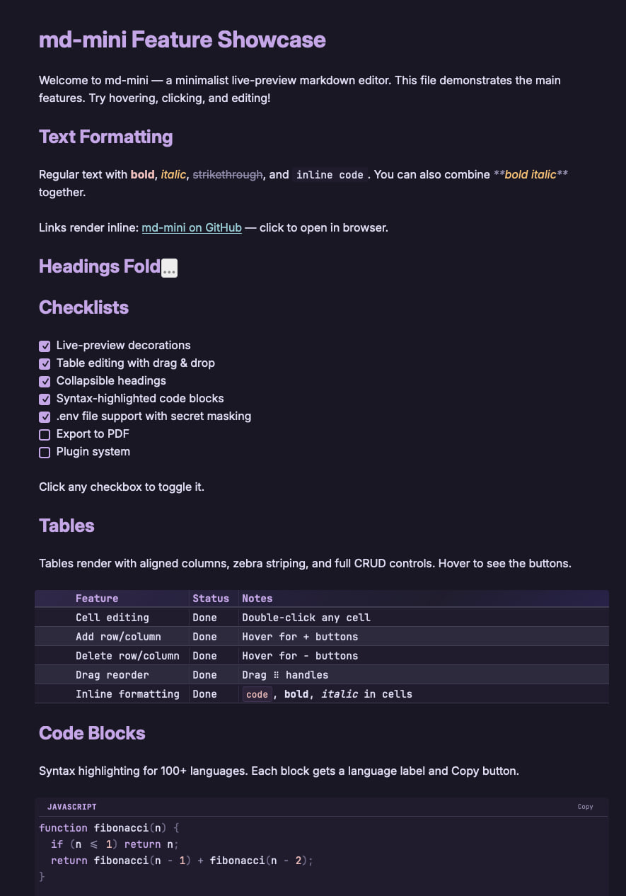

# mdmini

A minimalist live-preview markdown editor for macOS.

You edit raw markdown and see it rendered inline — no split panes, no mode switching. Built with Tauri 2, Svelte 5, and CodeMirror 6.



## Install

```bash
brew tap malinborn/mdmini
brew install --cask mdmini
```

Or download the `.dmg` from [Releases](https://github.com/malinborn/mdmini/releases).

## Usage

```bash
mdmini                    # Open empty editor
mdmini README.md          # Open a file
mdmini file1.md file2.md  # Open multiple files
```

## What it does

**Editor** — live-preview decorations that hide markdown syntax when your cursor moves away. Headings, bold, italic, strikethrough, links, code, blockquotes, lists, checkboxes — all rendered inline.

**Tables** — rendered as interactive widgets with aligned columns. Double-click to edit cells. Drag `⠿` handles to reorder rows and columns. Hover for `+`/`−` buttons. Inline `code`, **bold**, *italic* inside cells.

**Code blocks** — syntax highlighting for 100+ languages with language label and Copy button. Click a code block to edit, click away to preview.

**Collapsible headings** — hover any heading to reveal a fold toggle. Click to collapse the section.

**.env files** — opens with secret masking (keys like `PASSWORD`, `TOKEN`, `API_KEY` are hidden). Copy button copies the full value. Cmd+E toggles raw view.

**Code files** — `.py`, `.rs`, `.json`, `.yaml` and others open with native syntax highlighting.

**File watcher** — detects external changes (e.g., from AI agents editing the file) and auto-reloads. Cmd+Z to undo.

**Links** — click rendered links to open in browser.

**Themes** — dark (Rosé Pine) and light, switchable via menu. Gradient table headers.

## Keyboard Shortcuts

| Shortcut | Action |
|----------|--------|
| `Cmd+B` | Bold |
| `Cmd+I` | Italic |
| `Cmd+E` | Toggle raw markdown |
| `Cmd+F` | Find & replace |
| `Cmd+N` | New window |
| `Cmd+W` | Close window |
| `Cmd+S` | Save |
| `/` | Slash commands |

## Development

```bash
npm install
npm run tauri dev
```

If port 1420 is stuck: `lsof -ti:1420 | xargs kill -9`

### Build

```bash
npm run tauri build
```

### Tests

```bash
npm run test          # Vitest (frontend)
cargo test            # Rust (cd src-tauri)
npm run check         # Svelte types
```

## Tech Stack

[Tauri 2](https://v2.tauri.app) · [Svelte 5](https://svelte.dev) · [CodeMirror 6](https://codemirror.net) · [Lezer](https://lezer.codemirror.net) (markdown parser) · Vite

## License

[GPL-3.0](LICENSE)
