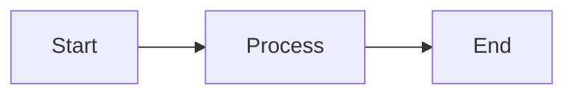
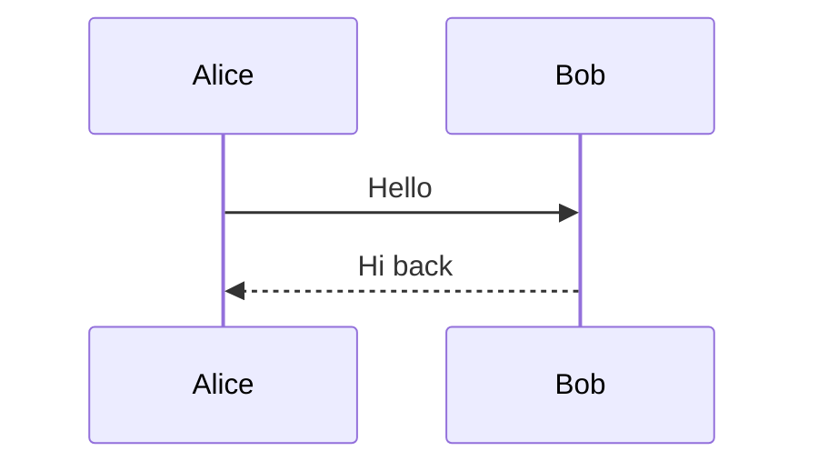

# Mermaid Diagrams Live Preview — Implementation Plan

> **For agentic workers:** REQUIRED SUB-SKILL: Use superpowers:subagent-driven-development (recommended) or superpowers:executing-plans to implement this plan task-by-task. Steps use checkbox (`- [ ]`) syntax for tracking.

**Goal:** Render mermaid fenced code blocks as inline SVG diagrams with lazy-loaded mermaid, debounced async rendering, and hybrid error display.

**Architecture:** New `mermaid.ts` module in `src/lib/editor/preview/` follows existing decorator pattern. `plugin.ts` detects `FencedCode` with language `mermaid` and delegates. Mermaid library is lazy-loaded on first use. Async renders update a content-addressed cache; a `StateEffect` triggers decoration rebuild when SVG is ready.

**Tech Stack:** mermaid (npm, lazy-loaded), CodeMirror 6 (WidgetType, StateEffect, ViewPlugin)

**Spec:** `docs/superpowers/specs/2026-04-05-mermaid-diagrams-design.md`

---

### Task 1: Install mermaid dependency

**Files:**
- Modify: `package.json`

- [ ] **Step 1: Install mermaid**

```bash
npm install mermaid
```

- [ ] **Step 2: Verify installation**

```bash
node -e "import('mermaid').then(m => console.log('mermaid version:', m.default.version || 'ok'))"
```

Expected: prints mermaid version or "ok"

- [ ] **Step 3: Commit**

```bash
git add package.json package-lock.json
git commit -m "feat(mermaid): add mermaid dependency"
```

---

### Task 2: Create mermaid render cache and lazy loader

**Files:**
- Create: `src/lib/editor/preview/mermaid.ts`

This task builds the core infrastructure: lazy loader, render cache, debounced render queue, and StateEffect. No decorations yet — just the engine.

- [ ] **Step 1: Create `mermaid.ts` with types, cache, lazy loader, and StateEffect**

```typescript
import { StateEffect } from '@codemirror/state';
import type { EditorView } from '@codemirror/view';

// -- Types --

interface MermaidCacheEntry {
  svg: string | null;
  error: string | null;
}

// -- StateEffect dispatched after a render completes --

export const mermaidRendered = StateEffect.define<null>();

// -- Lazy loader --

type MermaidAPI = {
  initialize: (config: Record<string, unknown>) => void;
  render: (id: string, definition: string) => Promise<{ svg: string }>;
};

let mermaidModule: MermaidAPI | null = null;
let mermaidLoading: Promise<MermaidAPI> | null = null;

function currentTheme(): 'default' | 'dark' {
  return document.documentElement.dataset.theme === 'dark' ? 'dark' : 'default';
}

async function loadMermaid(): Promise<MermaidAPI> {
  if (mermaidModule) return mermaidModule;
  if (mermaidLoading) return mermaidLoading;

  mermaidLoading = import('mermaid').then((m) => {
    const api = m.default;
    api.initialize({
      startOnLoad: false,
      theme: currentTheme(),
      suppressErrors: true,
    });
    mermaidModule = api as unknown as MermaidAPI;
    return mermaidModule;
  });

  return mermaidLoading;
}

// -- Render cache (content-addressed) --

const cache = new Map<string, MermaidCacheEntry>();
const MAX_CACHE = 50;

export function getCached(source: string): MermaidCacheEntry | undefined {
  return cache.get(source);
}

function setCache(source: string, entry: MermaidCacheEntry): void {
  if (cache.size >= MAX_CACHE) {
    // Evict oldest (first inserted)
    const first = cache.keys().next().value;
    if (first !== undefined) cache.delete(first);
  }
  cache.set(source, entry);
}

// -- Render queue (sequential, mermaid can't render concurrently) --

let renderCounter = 0;
let rendering = false;
const queue: Array<{ source: string; view: EditorView; resolve: () => void }> = [];

async function processQueue(): Promise<void> {
  if (rendering) return;
  rendering = true;

  while (queue.length > 0) {
    const job = queue.shift()!;
    // Skip if already cached (a newer job for same source may have resolved it)
    if (cache.has(job.source) && cache.get(job.source)!.svg !== null) {
      job.resolve();
      continue;
    }

    try {
      const api = await loadMermaid();
      const id = `mermaid-render-${renderCounter++}`;
      const { svg } = await api.render(id, job.source);
      const prev = cache.get(job.source);
      setCache(job.source, { svg, error: prev?.error ? null : null });
    } catch (e) {
      const errorMsg = e instanceof Error ? e.message : String(e);
      // Keep last valid SVG if exists
      const prev = cache.get(job.source);
      setCache(job.source, {
        svg: prev?.svg ?? null,
        error: errorMsg,
      });
    }

    // Dispatch effect to trigger decoration rebuild
    try {
      job.view.dispatch({ effects: mermaidRendered.of(null) });
    } catch {
      // View may be destroyed
    }
    job.resolve();
  }

  rendering = false;
}

// -- Debounced render request --

const debounceTimers = new Map<string, ReturnType<typeof setTimeout>>();
const DEBOUNCE_MS = 300;

export function requestRender(source: string, view: EditorView): void {
  // If already cached with SVG, no render needed
  const existing = cache.get(source);
  if (existing?.svg) return;

  // Debounce by source text
  const existing_timer = debounceTimers.get(source);
  if (existing_timer) clearTimeout(existing_timer);

  debounceTimers.set(
    source,
    setTimeout(() => {
      debounceTimers.delete(source);
      new Promise<void>((resolve) => {
        queue.push({ source, view, resolve });
        processQueue();
      });
    }, DEBOUNCE_MS)
  );
}

// -- Theme change: clear cache and re-render --

export function reinitializeTheme(): void {
  if (!mermaidModule) return;
  mermaidModule.initialize({
    startOnLoad: false,
    theme: currentTheme(),
    suppressErrors: true,
  });
  cache.clear();
}
```

- [ ] **Step 2: Verify TypeScript compiles**

```bash
cd /Users/maximkovalevskij/playground/md-mini && npx tsc --noEmit --skipLibCheck
```

Expected: no errors related to `mermaid.ts`

- [ ] **Step 3: Commit**

```bash
git add src/lib/editor/preview/mermaid.ts
git commit -m "feat(mermaid): add lazy loader, render cache, and debounced queue"
```

---

### Task 3: Create MermaidWidget and decoration function

**Files:**
- Modify: `src/lib/editor/preview/mermaid.ts` (add widget + decorator)

This task adds the `MermaidWidget` class and the `decorateMermaidBlock` function that `plugin.ts` will call.

- [ ] **Step 1: Add MermaidWidget and decorateMermaidBlock to `mermaid.ts`**

Add these imports at the top of `mermaid.ts`:

```typescript
import { Decoration, WidgetType } from '@codemirror/view';
import type { RangeSetBuilder } from '@codemirror/state';
import type { SyntaxNode } from '@lezer/common';
import { cursorInRange } from './utils';
```

Remove the existing standalone imports that overlap (keep `StateEffect` from `@codemirror/state`). The final import block should be:

```typescript
import { Decoration, WidgetType } from '@codemirror/view';
import type { EditorView } from '@codemirror/view';
import { StateEffect } from '@codemirror/state';
import type { RangeSetBuilder } from '@codemirror/state';
import type { SyntaxNode } from '@lezer/common';
import { cursorInRange } from './utils';
```

Add the widget class and decorator function at the end of the file:

```typescript
// -- Widget --

class MermaidWidget extends WidgetType {
  constructor(
    private source: string,
    private svg: string | null,
    private error: string | null
  ) {
    super();
  }

  eq(other: MermaidWidget): boolean {
    return (
      this.source === other.source &&
      (this.svg !== null) === (other.svg !== null) &&
      (this.error !== null) === (other.error !== null) &&
      this.error === other.error
    );
  }

  toDOM(): HTMLElement {
    const container = document.createElement('div');
    container.className = 'cm-md-mermaid-container';

    if (this.svg) {
      const svgWrapper = document.createElement('div');
      svgWrapper.className = 'cm-md-mermaid-svg';
      svgWrapper.innerHTML = this.svg;
      container.appendChild(svgWrapper);
    }

    if (this.error) {
      const errorBar = document.createElement('div');
      errorBar.className = 'cm-md-mermaid-error';
      // Truncate long error messages
      const msg = this.error.length > 150 ? this.error.slice(0, 147) + '...' : this.error;
      errorBar.textContent = `⚠ ${msg}`;
      container.appendChild(errorBar);
    }

    if (!this.svg && !this.error) {
      const placeholder = document.createElement('div');
      placeholder.className = 'cm-md-mermaid-placeholder';
      placeholder.textContent = 'Rendering diagram...';
      container.appendChild(placeholder);
    }

    return container;
  }

  ignoreEvent(): boolean {
    return true;
  }
}

// -- Decorator function (called from plugin.ts) --

export function decorateMermaidBlock(
  view: EditorView,
  node: SyntaxNode,
  builder: RangeSetBuilder<Decoration>
): void {
  if (cursorInRange(view, node.from, node.to, true)) return;

  const doc = view.state.doc;
  const startLine = doc.lineAt(node.from);
  const endLine = doc.lineAt(node.to);

  // Extract mermaid source (lines between fences, exclusive)
  const firstContentLineNum = startLine.number + 1;
  const lastContentLineNum = endLine.number - 1;
  const hasContent = firstContentLineNum <= lastContentLineNum;

  if (!hasContent) return;

  const source = doc.sliceString(
    doc.line(firstContentLineNum).from,
    doc.line(lastContentLineNum).to
  );

  if (!source.trim()) return;

  // Look up cache
  const cached = getCached(source);
  const svg = cached?.svg ?? null;
  const error = cached?.error ?? null;

  // Request render if not cached
  if (!cached || !cached.svg) {
    requestRender(source, view);
  }

  // Hide all lines of the fenced block, replace with widget on first line
  for (let i = startLine.number; i <= endLine.number; i++) {
    const line = doc.line(i);

    if (i === startLine.number) {
      // First line: line decoration + widget
      builder.add(
        line.from,
        line.from,
        Decoration.line({ class: 'cm-md-mermaid-line' })
      );
      builder.add(
        line.from,
        line.to,
        Decoration.replace({
          widget: new MermaidWidget(source, svg, error),
        })
      );
    } else {
      // Subsequent lines: hide
      builder.add(
        line.from,
        line.from,
        Decoration.line({ class: 'cm-md-mermaid-line-hidden' })
      );
      if (line.length > 0) {
        builder.add(line.from, line.to, Decoration.replace({}));
      }
    }
  }
}
```

- [ ] **Step 2: Verify TypeScript compiles**

```bash
cd /Users/maximkovalevskij/playground/md-mini && npx tsc --noEmit --skipLibCheck
```

Expected: no errors

- [ ] **Step 3: Commit**

```bash
git add src/lib/editor/preview/mermaid.ts
git commit -m "feat(mermaid): add MermaidWidget and decoration function"
```

---

### Task 4: Wire mermaid decorator into plugin.ts

**Files:**
- Modify: `src/lib/editor/preview/plugin.ts:1-21,51-53,86-95`

- [ ] **Step 1: Add mermaid import to plugin.ts**

Add this import at line 20 (after the table import):

```typescript
import { decorateMermaidBlock, mermaidRendered } from './mermaid';
```

- [ ] **Step 2: Update FencedCode case in buildDecorations**

Replace the `FencedCode` case (lines 51-53) in the `switch` statement:

```typescript
        case 'FencedCode': {
          // Check if this is a mermaid block
          const doc = view.state.doc;
          const fenceLine = doc.lineAt(node.from);
          const fenceText = doc.sliceString(fenceLine.from, fenceLine.to);
          const langMatch = fenceText.match(/^`{3,}(\w+)/);
          if (langMatch && langMatch[1].toLowerCase() === 'mermaid') {
            decorateMermaidBlock(view, node.node, builder);
          } else {
            decorateFencedCode(view, node.node, builder);
          }
          return false;
        }
```

- [ ] **Step 3: Update the `update()` method to react to mermaidRendered effects**

In the ViewPlugin's `update` method (lines 86-95), add a check for the mermaid effect. Replace the condition:

```typescript
    update(update: ViewUpdate) {
      const treeChanged = syntaxTree(update.state) !== syntaxTree(update.startState);
      const mermaidUpdate = update.transactions.some((tr) =>
        tr.effects.some((e) => e.is(mermaidRendered))
      );
      if (update.docChanged || update.viewportChanged || update.selectionSet || treeChanged || mermaidUpdate) {
        try {
          this.decorations = buildDecorations(update.view);
        } catch (e) {
          console.warn('Live preview decoration error:', e);
          this.decorations = Decoration.none;
        }
      }
    }
```

- [ ] **Step 4: Verify TypeScript compiles**

```bash
cd /Users/maximkovalevskij/playground/md-mini && npx tsc --noEmit --skipLibCheck
```

Expected: no errors

- [ ] **Step 5: Commit**

```bash
git add src/lib/editor/preview/plugin.ts
git commit -m "feat(mermaid): wire mermaid decorator into live preview plugin"
```

---

### Task 5: Add CSS styles for mermaid widgets

**Files:**
- Modify: `src/styles/editor.css`

- [ ] **Step 1: Add mermaid CSS at the end of `editor.css`**

Append after the last rule in `editor.css`:

```css
/* Mermaid diagrams */
.cm-md-mermaid-line {
  font-size: 0;
  line-height: 0;
  height: 0;
  overflow: hidden;
}

.cm-md-mermaid-line-hidden {
  font-size: 0;
  line-height: 0;
  height: 0;
  overflow: hidden;
}

.cm-md-mermaid-container {
  display: flex;
  flex-direction: column;
  align-items: center;
  background: var(--color-code-bg);
  border-radius: 6px;
  padding: 16px;
  margin: 4px 0;
  overflow: hidden;
}

.cm-md-mermaid-svg {
  width: 100%;
  display: flex;
  justify-content: center;
}

.cm-md-mermaid-svg svg {
  max-width: 100%;
  height: auto;
}

.cm-md-mermaid-placeholder {
  color: var(--color-list-marker);
  font-family: var(--font-code);
  font-size: 0.85em;
  padding: 24px;
  text-align: center;
}

.cm-md-mermaid-error {
  width: 100%;
  font-family: var(--font-code);
  font-size: 0.8em;
  color: #b45309;
  background: rgba(180, 83, 9, 0.08);
  padding: 6px 12px;
  border-radius: 4px;
  margin-top: 8px;
  white-space: nowrap;
  overflow: hidden;
  text-overflow: ellipsis;
}

:root[data-theme='dark'] .cm-md-mermaid-error {
  color: #f6c177;
  background: rgba(246, 193, 119, 0.1);
}
```

- [ ] **Step 2: Commit**

```bash
git add src/styles/editor.css
git commit -m "feat(mermaid): add CSS styles for mermaid diagram widgets"
```

---

### Task 6: Add theme sync on theme change

**Files:**
- Modify: `src/App.svelte` (or wherever theme changes are applied)

We need to call `reinitializeTheme()` when the user switches between light/dark themes so mermaid re-renders with matching colors.

- [ ] **Step 1: Find where theme changes are applied**

Search for where `data-theme` attribute is set on `document.documentElement`:

```bash
cd /Users/maximkovalevskij/playground/md-mini && grep -rn "data-theme" src/ --include="*.svelte" --include="*.ts"
```

- [ ] **Step 2: Add reinitializeTheme call**

In the file that applies the theme (likely `App.svelte`), import and call `reinitializeTheme` in the same `$effect` or reactive block that updates `data-theme`:

```typescript
import { reinitializeTheme } from './lib/editor/preview/mermaid';
```

In the effect that sets `document.documentElement.dataset.theme`:

```typescript
// After setting data-theme attribute:
reinitializeTheme();
```

This clears the mermaid cache and re-initializes with the new theme. The next decoration rebuild will trigger fresh renders.

- [ ] **Step 3: Verify it compiles**

```bash
cd /Users/maximkovalevskij/playground/md-mini && npx tsc --noEmit --skipLibCheck
```

- [ ] **Step 4: Commit**

```bash
git add -A
git commit -m "feat(mermaid): sync mermaid theme on light/dark switch"
```

---

### Task 7: Manual testing and fixes

**Files:**
- Possibly modify: `src/lib/editor/preview/mermaid.ts`, `src/styles/editor.css`

- [ ] **Step 1: Start dev server**

```bash
cd /Users/maximkovalevskij/playground/md-mini && lsof -ti:1420 | xargs kill -9 2>/dev/null; npm run tauri dev
```

- [ ] **Step 2: Test basic rendering**

Create a test file with this content:

````markdown
# Mermaid Test



Some text between diagrams.


````

Verify:
- Both diagrams render as SVG inline
- Clicking into a mermaid block reveals raw code
- Moving cursor out re-renders the diagram
- "Rendering diagram..." placeholder shows briefly on first load

- [ ] **Step 3: Test error handling**

Type invalid mermaid syntax:

````markdown
```mermaid
graph LR
    A -->
```
````

Verify:
- Error message shows with ⚠ prefix
- Fix the syntax → diagram renders, error disappears
- Break it again → last valid SVG + error overlay (hybrid display)

- [ ] **Step 4: Test theme switching**

Switch between light and dark themes. Verify:
- Diagrams re-render with appropriate mermaid theme
- Colors match the editor theme

- [ ] **Step 5: Test alongside regular code blocks**

Verify that regular fenced code blocks (` ```javascript `, ` ```python `, etc.) still render normally with language label + copy button.

- [ ] **Step 6: Fix any issues found, commit**

```bash
git add -A
git commit -m "fix(mermaid): address issues from manual testing"
```

Only create this commit if fixes were needed.
