# Обратный AI-канал: запросы из документа к агенту

Дизайн-спека. Статус: на ревью у владельца.

## 1. Рамка

Сегодня AI-интерфейс md-mini односторонний. Агент умеет `show` (покажи вот тут),
`edit` (вот новое содержимое) и `ask` (ответь на вопрос кнопками) — всё это идёт
**от агента к документу**. Обратно, от человека к агенту, канала нет: если ты
читаешь спеку и у тебя вопрос по абзацу, приходится переключаться в чат и
руками объяснять, о каком месте речь.

Фича добавляет обратное направление: **запрос**, который человек кладёт в
документ, а агент забирает и закрывает.

Запрос — это не «вопрос», а комментарий с двумя возможными резолюциями:
текстовый ответ либо правка документа. Правку агенту добавлять не нужно, у него
уже есть `mdmini edit`; запрос лишь должен закрываться в обоих случаях.

**Асимметрия, из которой растёт вся сложность.** `ask` работает потому, что
инициатор — агент, а человек и так смотрит в приложение. Здесь инициатор —
человек, а агента может не существовать вовсе, либо их может быть несколько, и
контекст исходного разговора есть только у одного из них. Поэтому половина
дизайна — не про транспорт, а про прицел.

## 2. Принятые решения

| Развилка | Решение | Почему |
|---|---|---|
| Кто на другом конце | Гибрид: доставка сразу, если агент ждёт; иначе очередь в md-mini | Работает и с живой сессией, и без неё. Спавн агента из md-mini отброшен — это выход за рамки редактора |
| Механизм слушания | Pull: агент вызывает `next`. Персистентной подписки нет вообще | Ноль новых сущностей. Ожидающий живёт ровно столько, сколько живёт вызов — см. §5 |
| Прицел | Запрос рождается адресованным: `preferred_cwd` = cwd агента, который последним трогал этот файл через AI-интерфейс | md-mini уже знает этот факт — каждый запрос по сокету несёт cwd. «Агент, написавший этот текст» — точный ключ роутинга, случайный агент, открывший файл, — нет |
| Адресат молчит | Авто-открытие остальным только если его cwd физически исчез. Иначе — кнопка «открыть всем» в блоке | Ни одного ответа без контекста без твоего ведома |
| Адресация как подстраховка | Абсолютный путь + скоуп по cwd — вторичный ключ, когда адресата нет | Документ, который агент никогда не трогал, открыт скоупу сразу |
| Worktrees | Repo-scope с атомарным claim, поверх прицела | Ты читаешь копию из main-чекаута, а агент живёт в `.claude/worktrees/foo`. Прицел этот случай поглощает: адресат — последний писавший, в какой бы копии ты ни читал |
| Передача очереди | Claim — это лиза, а не pop | «Сессия схлопнулась» и «хочу спросить другого» становятся одним механизмом, а не двумя |
| Несколько агентов сразу | Только последовательный requeue в v1 | Веер требует N ответов и частичных таймаутов в UI. Формат хранения многоответный с первого дня |
| Ручная передача | ID запроса как capability-токен + кнопка «копировать команду» | Обходит роутинг целиком. Побочный эффект важнее основного: фича полезна с первого дня, даже если ни один агент не опрашивает очередь |
| Первое привязывание | Три слоя: пиггибэк `pending_requests` в ответах существующих верб, инструкция-условие в сниппетах, готовый `Stop`-хук | Инструкции-таймеры агент не соблюдает, условия на наблюдаемые данные — соблюдает. Хук вообще не требует комплаенса модели |
| Где живёт запрос | Вне текста документа, sidecar в app data | Полный `edit` от агента физически не может стереть запрос, git остаётся чистым |
| Вид | Блок-виджет под строкой якоря, как `ai-ask` | Оба направления выглядят одним диалогом. Переиспользует выстраданную механику, а не строит вторую такую же |

## 3. Модель данных

```
Request {
  id:            "q-7f3a2c"       // короткий стабильный ID, он же capability-токен
  path:          "/abs/path/spec.md"
  anchor:        { line: 42, quote: "We ship via Caddy" }
  body:          "Почему не nginx? Разверни абзац."
  state:         pending | claimed | answered | closed
  preferred_cwd: "/repo/.claude/worktrees/foo" | null   // адресат
  open_to_scope: false            // true после «открыть всем» или исчезновения адресата
  claim:         { by_cwd, at } | null
  answers:       [ { by_cwd, text, at } ]   // массив с первого дня
  excluded:      [ by_cwd ]        // кого не пускать после «переадресовать»
  created_at
}
```

Источник истины — Rust. Он обязан отвечать на `mdmini question <id>` независимо
от того, открыт ли документ, и переживать рестарт приложения. Хранилище —
`paths::app_data_dir()/requests.json`, то есть dev-сборка изолирована от релизной
автоматически. Фронт держит только живые позиции якорей в CM6 StateField и
репортит их назад тем же heartbeat-паттерном, что `update_session_document`.

Отдельно от запросов Rust помнит **последнего писавшего по каждому пути**: cwd
того агента, который последним сделал `edit`/`show`/`ask` на этот файл. Это и
есть источник `preferred_cwd` в момент создания запроса.

GC: закрытые запросы старше N дней и запросы на исчезнувшие файлы удаляются.

## 4. Вербы

| Команда | Поведение |
|---|---|
| `mdmini next [<file>] [--timeout N]` | Забирает следующий доступный этому агенту запрос и клеймит его. `--timeout 0` — мгновенная проверка «есть что-нибудь?». `--timeout 300` — блокирующее ожидание, зеркало `ask` |
| `mdmini question <id>` | Печатает запрос, путь, якорь и окружающий контекст. Прицел и скоуп игнорирует |
| `mdmini answer <id>` | Ответ со stdin, закрывает запрос. Прицел и скоуп игнорирует, побеждает чужую лизу |

Те же три — как MCP-tools, паритет с `show`/`edit`/`ask`.

**Пиггибэк.** `show`, `edit` и `ask` дописывают в свой JSON `pending_requests` —
сколько запросов **доступно именно этому вызывающему**. Не общее число: сказать
«их два» агенту, который не вправе их забрать, значит спровоцировать бесполезный
`next` и запутать его. Поле — единственное изменение существующего контракта
ответов, обратно совместимое.

---

# Пользовательские флоу

## П1. Живой агент ждёт — счастливый путь

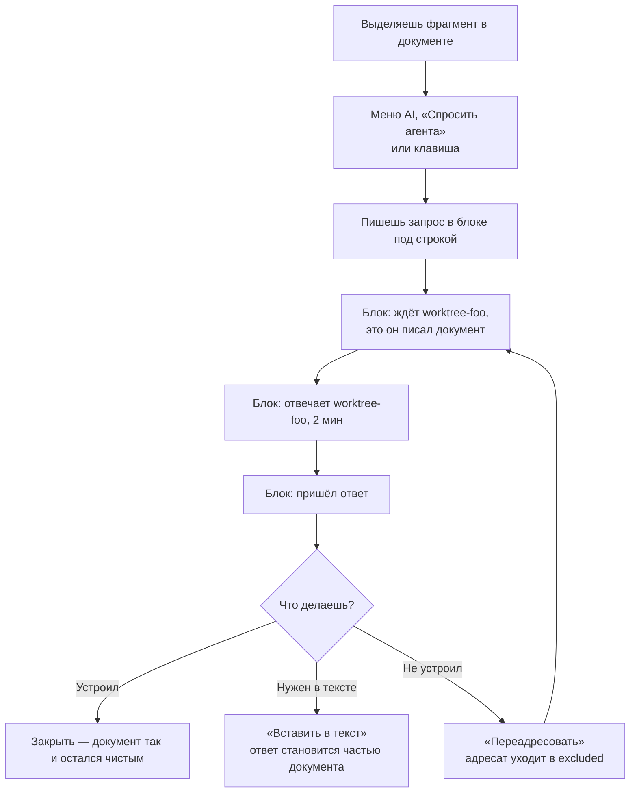
```mermaid
flowchart TD
    A["Выделяешь фрагмент в документе"] --> B["Меню AI, «Спросить агента»<br/>или клавиша"]
    B --> C["Пишешь запрос в блоке под строкой"]
    C --> D["Блок: ждёт worktree-foo,<br/>это он писал документ"]
    D --> E["Блок: отвечает worktree-foo, 2 мин"]
    E --> F["Блок: пришёл ответ"]
    F --> G{"Что делаешь?"}
    G -->|"Устроил"| H["Закрыть — документ так и остался чистым"]
    G -->|"Нужен в тексте"| I["«Вставить в текст»<br/>ответ становится частью документа"]
    G -->|"Не устроил"| J["«Переадресовать»<br/>адресат уходит в excluded"]
    J --> D
```

## П2. Никто не ждёт — вопрос лежит в очереди

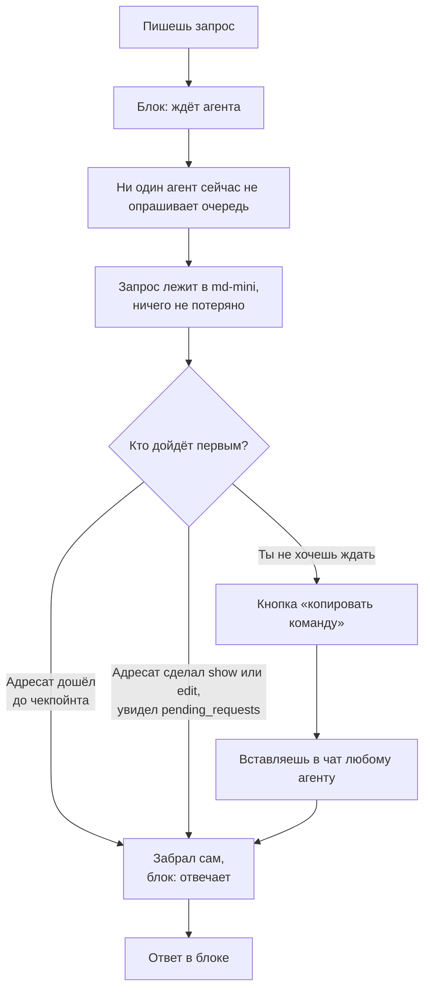
```mermaid
flowchart TD
    A["Пишешь запрос"] --> B["Блок: ждёт агента"]
    B --> C["Ни один агент сейчас не опрашивает очередь"]
    C --> D["Запрос лежит в md-mini,<br/>ничего не потеряно"]
    D --> E{"Кто дойдёт первым?"}
    E -->|"Адресат дошёл<br/>до чекпойнта"| F["Забрал сам,<br/>блок: отвечает"]
    E -->|"Адресат сделал show или edit,<br/>увидел pending_requests"| F
    E -->|"Ты не хочешь ждать"| G["Кнопка «копировать команду»"]
    G --> H["Вставляешь в чат любому агенту"]
    H --> F
    F --> I["Ответ в блоке"]
```

## П3. Ручная передача конкретного вопроса другому агенту

Основную спеку ты обсуждаешь с одним агентом, а один конкретный вопрос хочешь
отдать другому — не трогая очередь и не переключая контекст первого.

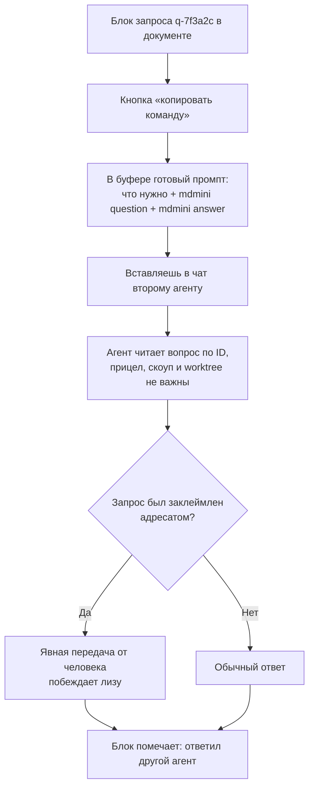
```mermaid
flowchart TD
    A["Блок запроса q-7f3a2c в документе"] --> B["Кнопка «копировать команду»"]
    B --> C["В буфере готовый промпт:<br/>что нужно + mdmini question + mdmini answer"]
    C --> D["Вставляешь в чат второму агенту"]
    D --> E["Агент читает вопрос по ID,<br/>прицел, скоуп и worktree не важны"]
    E --> F{"Запрос был заклеймлен<br/>адресатом?"}
    F -->|"Да"| G["Явная передача от человека<br/>побеждает лизу"]
    F -->|"Нет"| H["Обычный ответ"]
    G --> I["Блок помечает: ответил другой агент"]
    H --> I
```

## П4. Запрос на правку, а не на ответ

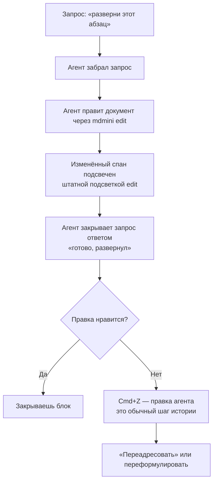
```mermaid
flowchart TD
    A["Запрос: «разверни этот абзац»"] --> B["Агент забрал запрос"]
    B --> C["Агент правит документ через mdmini edit"]
    C --> D["Изменённый спан подсвечен<br/>штатной подсветкой edit"]
    D --> E["Агент закрывает запрос ответом<br/>«готово, развернул»"]
    E --> F{"Правка нравится?"}
    F -->|"Да"| G["Закрываешь блок"]
    F -->|"Нет"| H["Cmd+Z — правка агента<br/>это обычный шаг истории"]
    H --> I["«Переадресовать» или переформулировать"]
```

## П5. Сессия агента схлопнулась

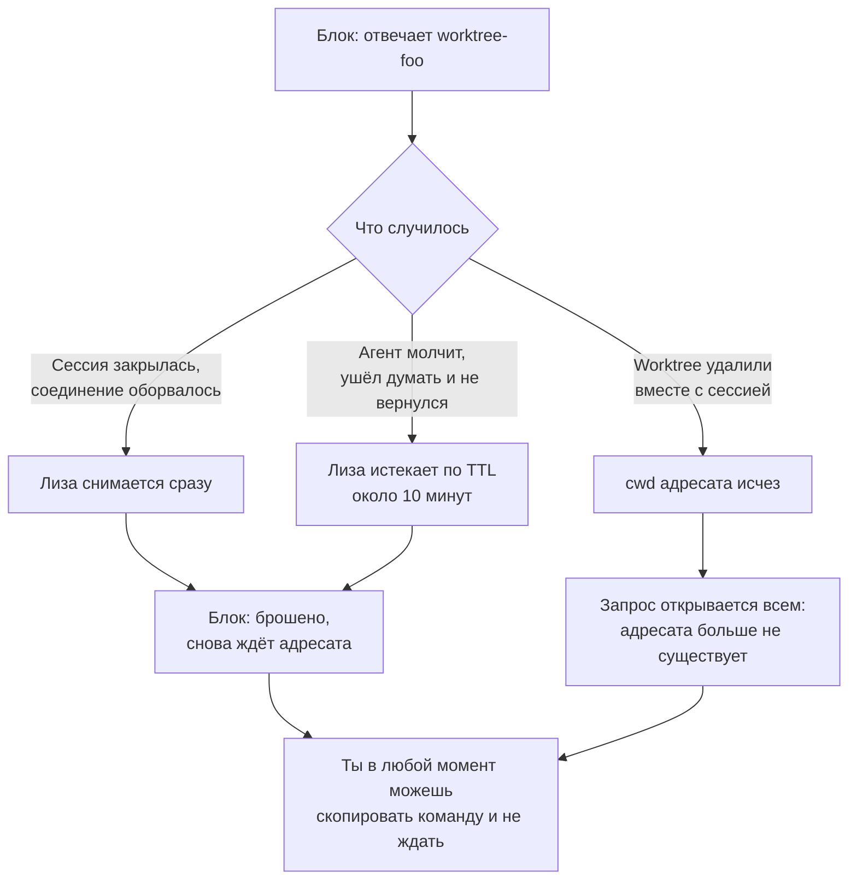
```mermaid
flowchart TD
    A["Блок: отвечает worktree-foo"] --> B{"Что случилось"}
    B -->|"Сессия закрылась,<br/>соединение оборвалось"| C["Лиза снимается сразу"]
    B -->|"Агент молчит,<br/>ушёл думать и не вернулся"| D["Лиза истекает по TTL<br/>около 10 минут"]
    B -->|"Worktree удалили<br/>вместе с сессией"| E["cwd адресата исчез"]
    C --> F["Блок: брошено,<br/>снова ждёт адресата"]
    D --> F
    E --> G["Запрос открывается всем:<br/>адресата больше не существует"]
    F --> H["Ты в любой момент можешь<br/>скопировать команду и не ждать"]
    G --> H
```

## П6. Якорь потерялся

Запрос живёт вне текста, поэтому он не может испортить документ — но текст под
ним может быть переписан до неузнаваемости.

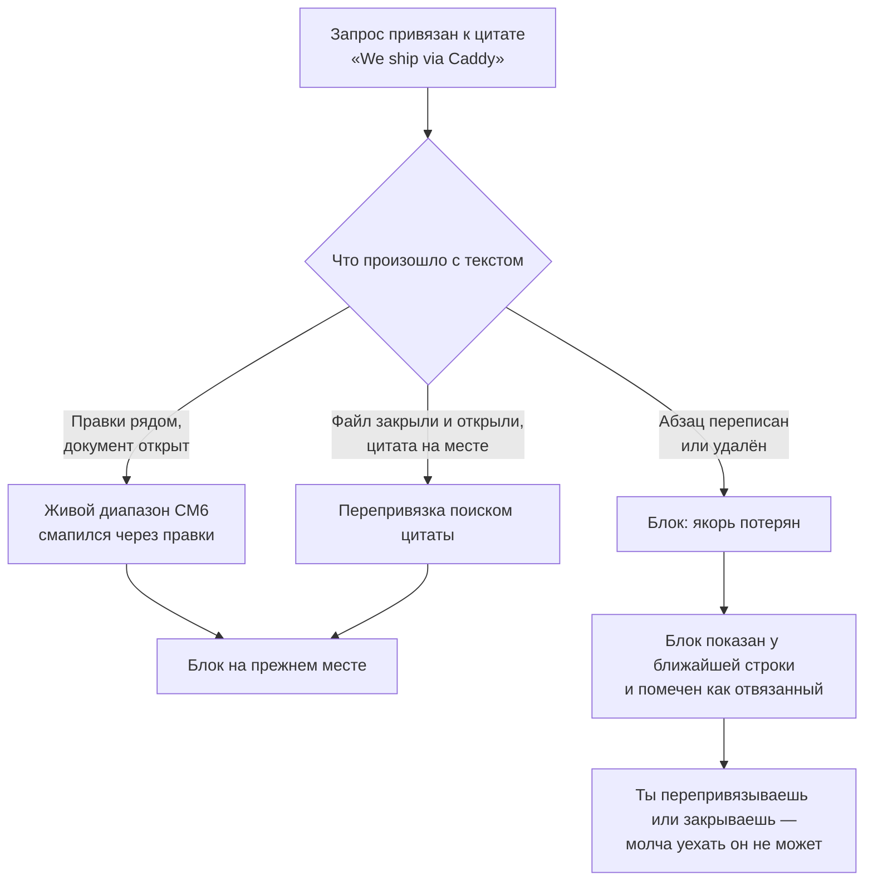
```mermaid
flowchart TD
    A["Запрос привязан к цитате<br/>«We ship via Caddy»"] --> B{"Что произошло с текстом"}
    B -->|"Правки рядом,<br/>документ открыт"| C["Живой диапазон CM6<br/>смапился через правки"]
    B -->|"Файл закрыли и открыли,<br/>цитата на месте"| D["Перепривязка поиском цитаты"]
    B -->|"Абзац переписан<br/>или удалён"| E["Блок: якорь потерян"]
    C --> F["Блок на прежнем месте"]
    D --> F
    E --> G["Блок показан у ближайшей строки<br/>и помечен как отвязанный"]
    G --> H["Ты перепривязываешь или закрываешь —<br/>молча уехать он не может"]
```

## П7. Адресат жив, но не отвечает

Случай, который отличает прицел от простой очереди: сессия ещё существует, но
не доходит до вопроса, а рядом работают другие агенты — без контекста.

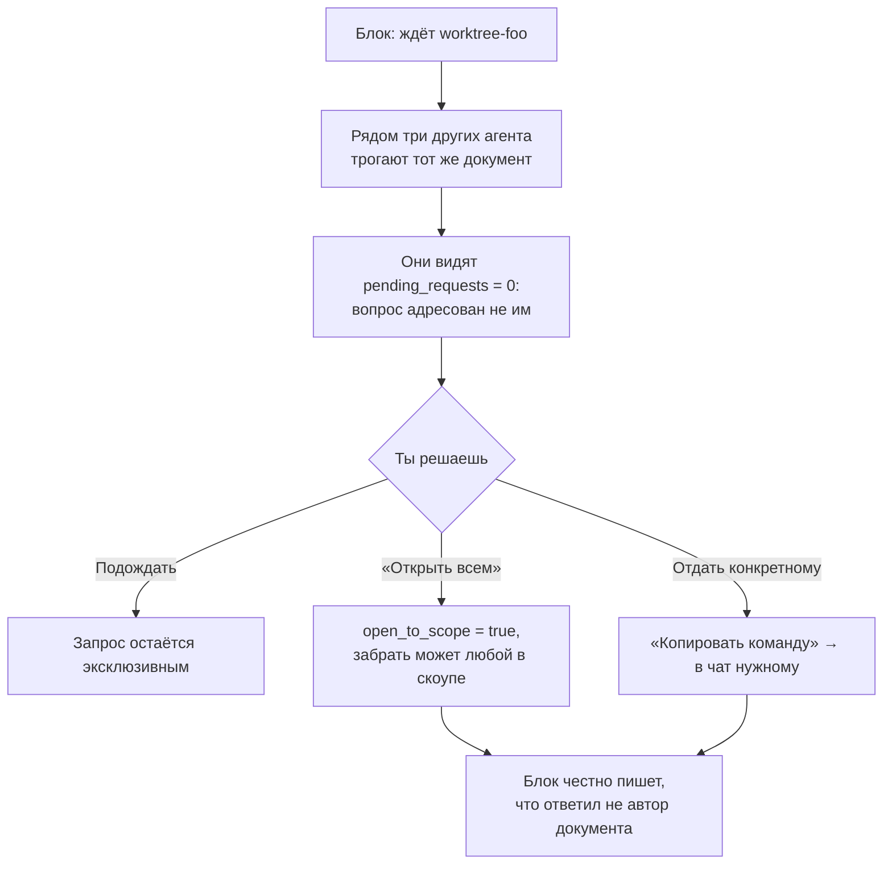
```mermaid
flowchart TD
    A["Блок: ждёт worktree-foo"] --> B["Рядом три других агента<br/>трогают тот же документ"]
    B --> C["Они видят pending_requests = 0:<br/>вопрос адресован не им"]
    C --> D{"Ты решаешь"}
    D -->|"Подождать"| E["Запрос остаётся эксклюзивным"]
    D -->|"«Открыть всем»"| F["open_to_scope = true,<br/>забрать может любой в скоупе"]
    D -->|"Отдать конкретному"| G["«Копировать команду» → в чат нужному"]
    F --> H["Блок честно пишет,<br/>что ответил не автор документа"]
    G --> H
```

---

# Как агент начинает слушать

## 5. Механизм: pull, а не подписка

Персистентного «привязывания» не существует. Транспорт — long-poll по
существующему сокету, ровно та же механика, что уже держит `ask`: соединение
обслуживается своим потоком и блокируется на своём reply-канале. `mdmini next`
открывает соединение, сервер регистрирует его reply-канал как ожидающего и
висит. Ни демона, ни порта, ни регистрации.

**Ожидающий живёт ровно столько, сколько живёт вызов.** Соединение закрылось —
слушателя нет. То есть «агент слушает» = «агент прямо сейчас внутри блокирующего
`next`», а значит в этот момент он ничего другого не делает: слушание и работа
взаимоисключающи. Отсюда три режима.

## Т1. Три режима слушания

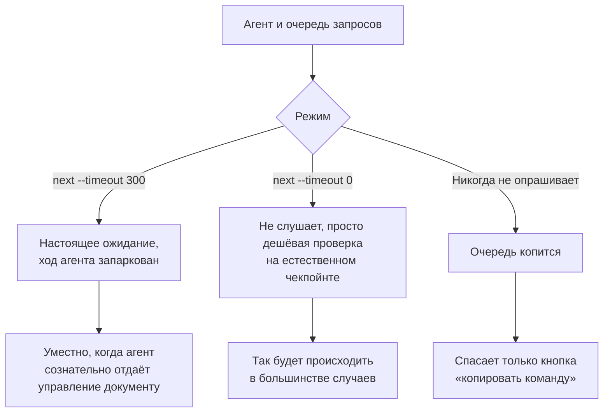
```mermaid
flowchart TD
    A["Агент и очередь запросов"] --> B{"Режим"}
    B -->|"next --timeout 300"| C["Настоящее ожидание,<br/>ход агента запаркован"]
    C --> D["Уместно, когда агент<br/>сознательно отдаёт управление документу"]
    B -->|"next --timeout 0"| E["Не слушает, просто дешёвая проверка<br/>на естественном чекпойнте"]
    E --> F["Так будет происходить<br/>в большинстве случаев"]
    B -->|"Никогда не опрашивает"| G["Очередь копится"]
    G --> H["Спасает только кнопка<br/>«копировать команду»"]
```

Именно поэтому путь через буфер обмена не роскошь, а фундамент: он единственный
не зависит от поведения агента вообще.

## Т2. Первое привязывание: три слоя

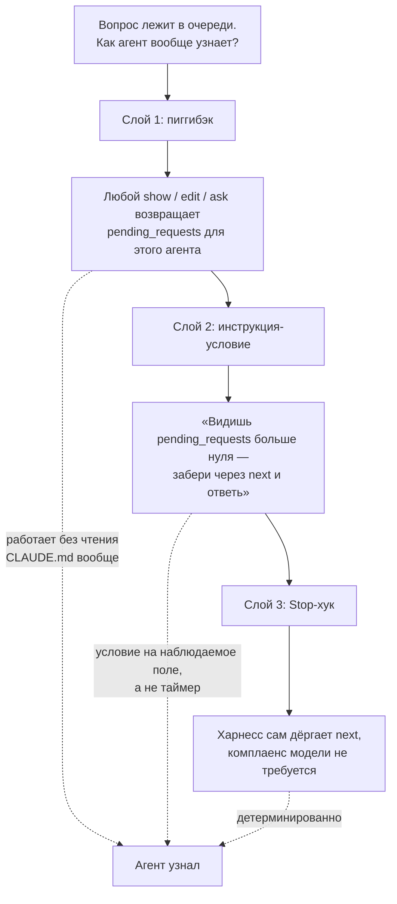
```mermaid
flowchart TD
    A["Вопрос лежит в очереди.<br/>Как агент вообще узнает?"] --> B["Слой 1: пиггибэк"]
    B --> C["Любой show / edit / ask возвращает<br/>pending_requests для этого агента"]
    C --> D["Слой 2: инструкция-условие"]
    D --> E["«Видишь pending_requests больше нуля —<br/>забери через next и ответь»"]
    E --> F["Слой 3: Stop-хук"]
    F --> G["Харнесс сам дёргает next,<br/>комплаенс модели не требуется"]
    C -.->|"работает без чтения<br/>CLAUDE.md вообще"| H["Агент узнал"]
    E -.->|"условие на наблюдаемое поле,<br/>а не таймер"| H
    G -.->|"детерминированно"| H
```

Формулировка в сниппете принципиальна. «Периодически проверяй документ» агент не
соблюдает — нет наблюдаемого события, которое напомнит о правиле. Условие на
данные соблюдается: *«в ответе `show`/`edit`/`ask` есть поле `pending_requests`;
если оно больше нуля — забери вопросы через `next` и ответь, прежде чем
продолжать»*. Плюс три событийных триггера: перед тем как спросить человека в
чате (он и так собирался заблокироваться), перед отчётом о завершении, и когда в
сообщении человека есть отсылка к документу.

## Т3. Stop-хук

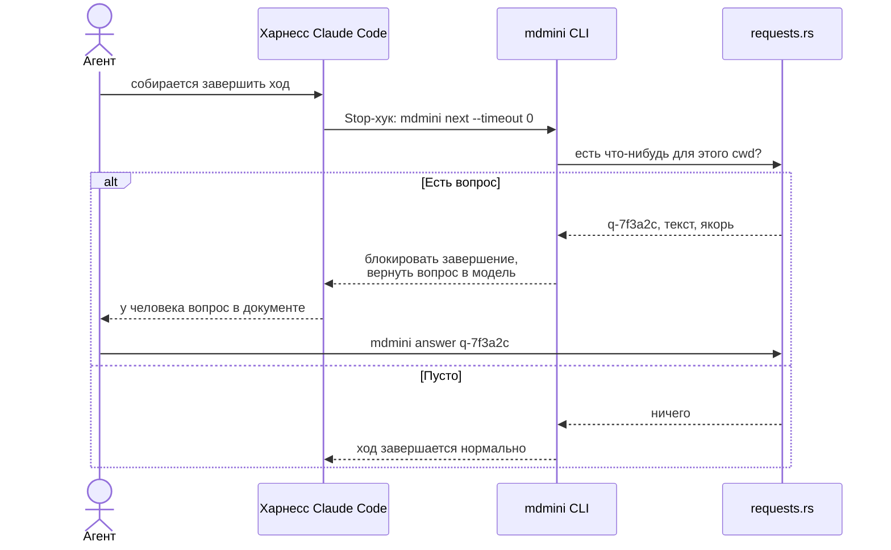
```mermaid
sequenceDiagram
    actor A as Агент
    participant K as Харнесс Claude Code
    participant C as mdmini CLI
    participant R as requests.rs

    A->>K: собирается завершить ход
    K->>C: Stop-хук: mdmini next --timeout 0
    C->>R: есть что-нибудь для этого cwd?
    alt Есть вопрос
        R-->>C: q-7f3a2c, текст, якорь
        C-->>K: блокировать завершение,<br/>вернуть вопрос в модель
        K-->>A: у человека вопрос в документе
        A->>R: mdmini answer q-7f3a2c
    else Пусто
        R-->>C: ничего
        C-->>K: ход завершается нормально
    end
```

Точную обвязку — код выхода против JSON-решения и как именно текст доезжает до
модели — сверить с актуальным контрактом хуков на этапе плана; по памяти это
утверждать нельзя. Отдаётся сниппетом `mdmini agent --hook`, по аналогии с тем,
как `mdmini agent` уже отдаёт абзац для `CLAUDE.md`.

---

# Технические флоу доставки

## Т4. Назначение адресата при создании

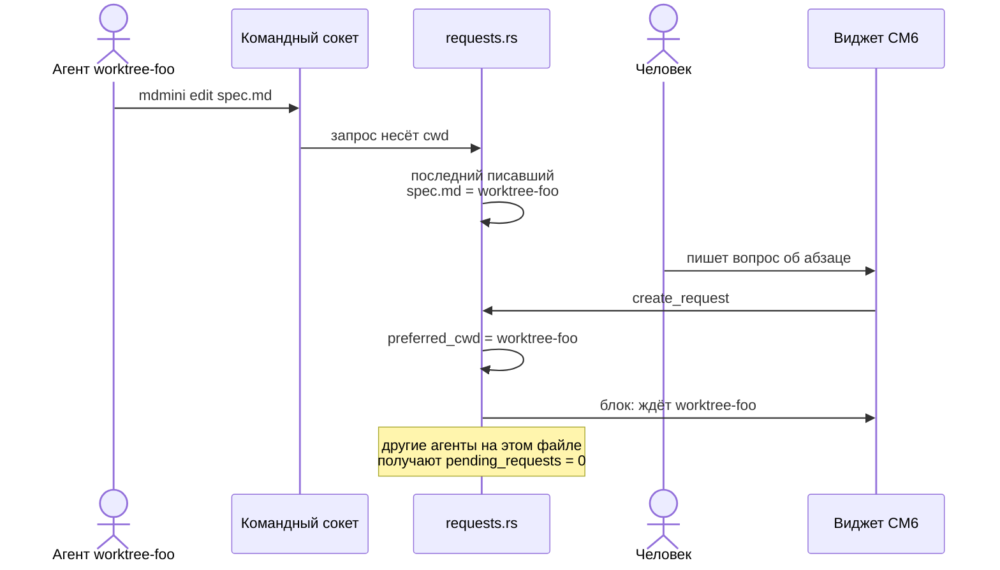
```mermaid
sequenceDiagram
    actor A as Агент worktree-foo
    participant S as Командный сокет
    participant R as requests.rs
    actor U as Человек
    participant W as Виджет CM6

    A->>S: mdmini edit spec.md
    S->>R: запрос несёт cwd
    R->>R: последний писавший<br/>spec.md = worktree-foo

    U->>W: пишет вопрос об абзаце
    W->>R: create_request
    R->>R: preferred_cwd = worktree-foo
    R->>W: блок: ждёт worktree-foo
    Note over R: другие агенты на этом файле<br/>получают pending_requests = 0
```

## Т5. Живая доставка: адресат уже ждёт

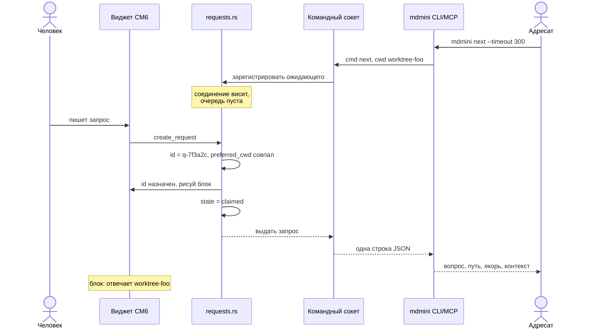
```mermaid
sequenceDiagram
    actor U as Человек
    participant W as Виджет CM6
    participant R as requests.rs
    participant S as Командный сокет
    participant C as mdmini CLI/MCP
    actor A as Адресат

    A->>C: mdmini next --timeout 300
    C->>S: cmd next, cwd worktree-foo
    S->>R: зарегистрировать ожидающего
    Note over R: соединение висит,<br/>очередь пуста

    U->>W: пишет запрос
    W->>R: create_request
    R->>R: id = q-7f3a2c, preferred_cwd совпал
    R->>W: id назначен, рисуй блок
    R->>R: state = claimed
    R-->>S: выдать запрос
    S-->>C: одна строка JSON
    C-->>A: вопрос, путь, якорь, контекст
    Note over W: блок: отвечает worktree-foo
```

## Т6. Поздний забор на чекпойнте

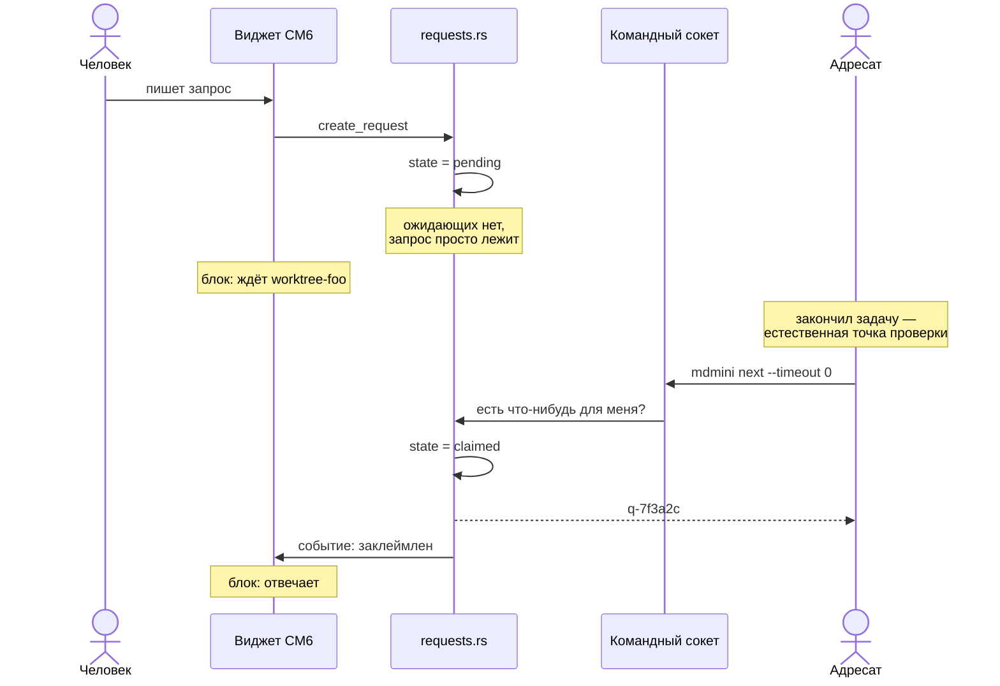
```mermaid
sequenceDiagram
    actor U as Человек
    participant W as Виджет CM6
    participant R as requests.rs
    participant S as Командный сокет
    actor A as Адресат

    U->>W: пишет запрос
    W->>R: create_request
    R->>R: state = pending
    Note over R: ожидающих нет,<br/>запрос просто лежит
    Note over W: блок: ждёт worktree-foo

    Note over A: закончил задачу —<br/>естественная точка проверки
    A->>S: mdmini next --timeout 0
    S->>R: есть что-нибудь для меня?
    R->>R: state = claimed
    R-->>A: q-7f3a2c
    R->>W: событие: заклеймлен
    Note over W: блок: отвечает
```

Ноль стоимости для агента, у которого ничего не лежит: `--timeout 0` отвечает
сразу.

## Т7. Кому доступен запрос: прицел, потом скоуп

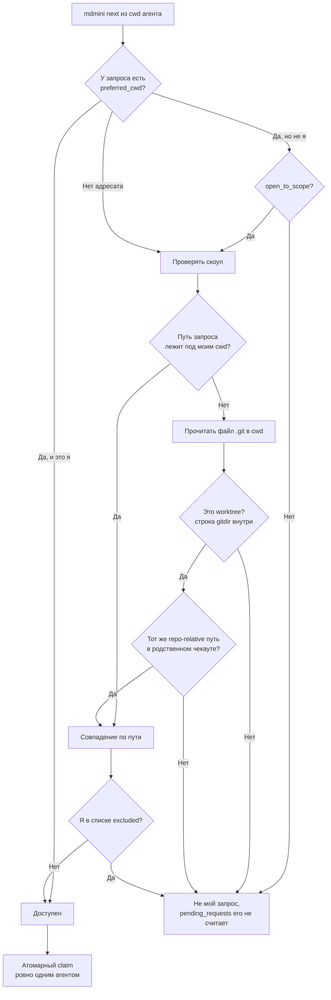
```mermaid
flowchart TD
    A["mdmini next из cwd агента"] --> B{"У запроса есть<br/>preferred_cwd?"}
    B -->|"Да, и это я"| K["Доступен"]
    B -->|"Да, но не я"| C{"open_to_scope?"}
    C -->|"Нет"| Z["Не мой запрос,<br/>pending_requests его не считает"]
    C -->|"Да"| D["Проверять скоуп"]
    B -->|"Нет адресата"| D
    D --> E{"Путь запроса<br/>лежит под моим cwd?"}
    E -->|"Да"| J["Совпадение по пути"]
    E -->|"Нет"| F["Прочитать файл .git в cwd"]
    F --> G{"Это worktree?<br/>строка gitdir внутри"}
    G -->|"Нет"| Z
    G -->|"Да"| H{"Тот же repo-relative путь<br/>в родственном чекауте?"}
    H -->|"Нет"| Z
    H -->|"Да"| J
    J --> I{"Я в списке excluded?"}
    I -->|"Да"| Z
    I -->|"Нет"| K
    K --> L["Атомарный claim<br/>ровно одним агентом"]
```

Родство определяется чтением файла — у worktree `.git` это текстовый файл со
строкой `gitdir:`. Никакого спавна `git` не требуется.

## Т8. Обход роутинга по ID

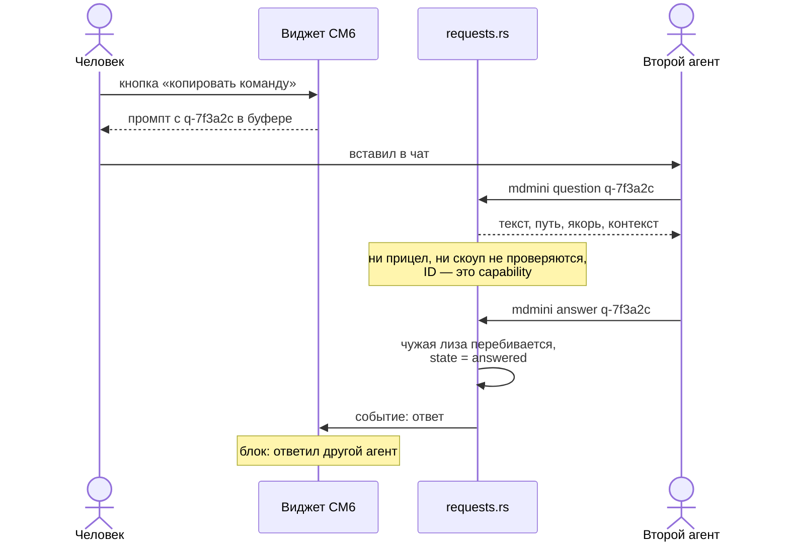
```mermaid
sequenceDiagram
    actor U as Человек
    participant W as Виджет CM6
    participant R as requests.rs
    actor A2 as Второй агент

    U->>W: кнопка «копировать команду»
    W-->>U: промпт с q-7f3a2c в буфере
    U->>A2: вставил в чат
    A2->>R: mdmini question q-7f3a2c
    R-->>A2: текст, путь, якорь, контекст
    Note over R: ни прицел, ни скоуп не проверяются,<br/>ID — это capability
    A2->>R: mdmini answer q-7f3a2c
    R->>R: чужая лиза перебивается,<br/>state = answered
    R->>W: событие: ответ
    Note over W: блок: ответил другой агент
```

## Т9. Жизненный цикл прицела

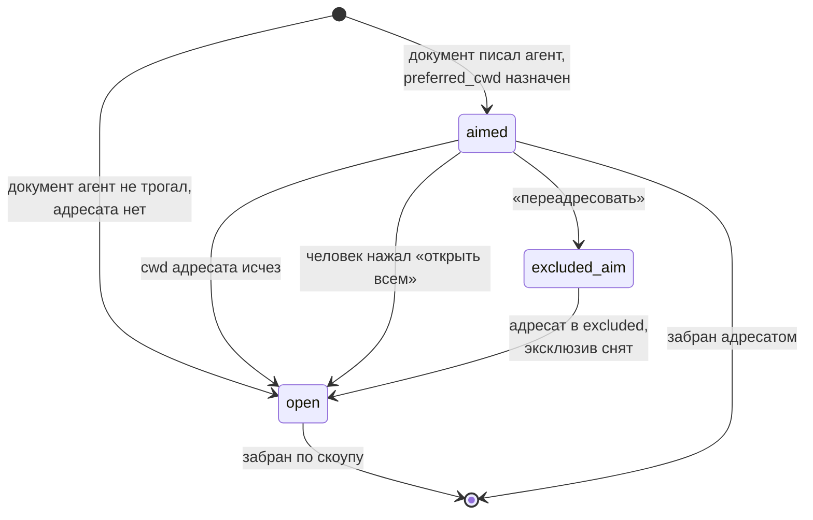
```mermaid
stateDiagram-v2
    [*] --> aimed: документ писал агент,<br/>preferred_cwd назначен
    [*] --> open: документ агент не трогал,<br/>адресата нет
    aimed --> open: cwd адресата исчез
    aimed --> open: человек нажал «открыть всем»
    aimed --> excluded_aim: «переадресовать»
    excluded_aim --> open: адресат в excluded,<br/>эксклюзив снят
    open --> [*]: забран по скоупу
    aimed --> [*]: забран адресатом
```

## Т10. Жизненный цикл лизы

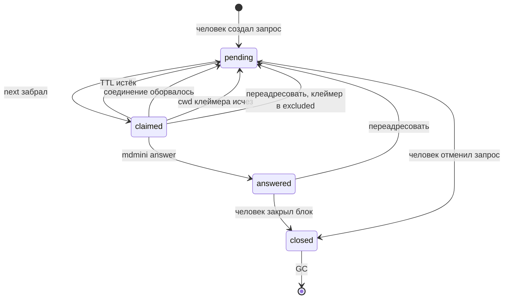
```mermaid
stateDiagram-v2
    [*] --> pending: человек создал запрос
    pending --> claimed: next забрал
    claimed --> answered: mdmini answer

    claimed --> pending: TTL истёк
    claimed --> pending: соединение оборвалось
    claimed --> pending: cwd клеймера исчез
    claimed --> pending: переадресовать, клеймер в excluded

    answered --> closed: человек закрыл блок
    answered --> pending: переадресовать

    pending --> closed: человек отменил запрос
    closed --> [*]: GC
```

Ключевая мысль: «передача очереди другой сессии» — не отдельный механизм, а
дефолтное поведение. Очередь принадлежит md-mini, агенты к ней только
подключаются.

## Т11. Обратный путь ответа в документ

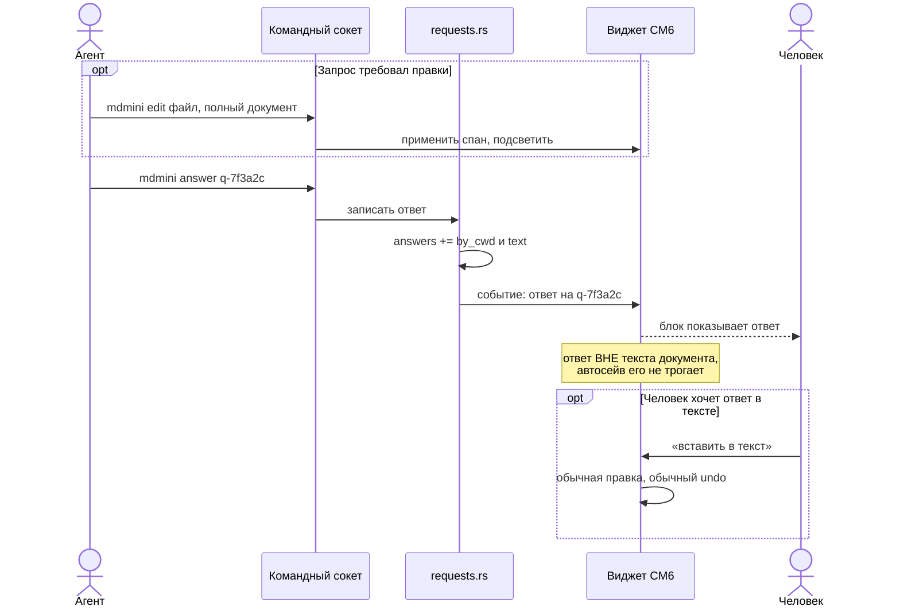
```mermaid
sequenceDiagram
    actor A as Агент
    participant S as Командный сокет
    participant R as requests.rs
    participant W as Виджет CM6
    actor U as Человек

    opt Запрос требовал правки
        A->>S: mdmini edit файл, полный документ
        S->>W: применить спан, подсветить
    end
    A->>S: mdmini answer q-7f3a2c
    S->>R: записать ответ
    R->>R: answers += by_cwd и text
    R->>W: событие: ответ на q-7f3a2c
    W-->>U: блок показывает ответ
    Note over W: ответ ВНЕ текста документа,<br/>автосейв его не трогает
    opt Человек хочет ответ в тексте
        U->>W: «вставить в текст»
        W->>W: обычная правка, обычный undo
    end
```

Полный `edit` от агента не может стереть запрос: запроса нет в тексте документа.
Это и было главным аргументом за хранение вне markdown.

## Т12. Рестарт и перепривязка

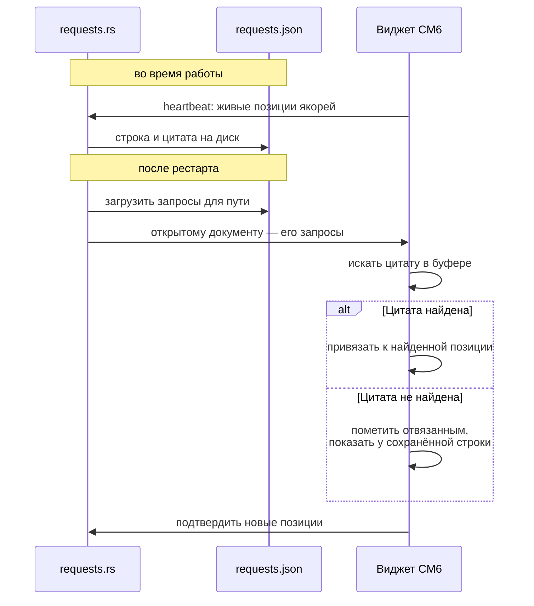
```mermaid
sequenceDiagram
    participant R as requests.rs
    participant J as requests.json
    participant W as Виджет CM6

    Note over R,J: во время работы
    W->>R: heartbeat: живые позиции якорей
    R->>J: строка и цитата на диск

    Note over R,J: после рестарта
    R->>J: загрузить запросы для пути
    R->>W: открытому документу — его запросы
    W->>W: искать цитату в буфере
    alt Цитата найдена
        W->>W: привязать к найденной позиции
    else Цитата не найдена
        W->>W: пометить отвязанным,<br/>показать у сохранённой строки
    end
    W->>R: подтвердить новые позиции
```

---

# UI

Блок-виджет под строкой якоря, классы `.cm-ai-request-*` поверх токенов
`--ai-ask-*` — одна визуальная семья с вопросами агента. Нулевой margin у корня
виджета, отступы на внешнем wrapper'е: это тот самый задокументированный капкан
height-map, из-за которого иначе ломается вертикальная навигация каретки.

Состояния в шапке блока: `ждёт worktree-foo`, `ждёт агента` (адресата нет),
`отвечает worktree-foo, 2 мин`, `ответ`, `ответил не автор документа`,
`брошено, снова ждёт адресата`, `якорь потерян`.

Кнопки: `копировать команду`, `открыть всем` (пока эксклюзив держится),
`переадресовать`, `вставить в текст`, `закрыть`.

Создание: клавиша плюс пункт в меню AI — «Спросить агента о выделенном». Пункт
меню обязателен: урок PR #11 в том, что у фичи должен быть постоянный дом, а не
одноразовая подсказка.

В буфер уезжает:

```
Ответь на вопрос q-7f3a2c из /path/spec.md (md-mini).
Прочитать:  mdmini question q-7f3a2c
Ответить:   mdmini answer q-7f3a2c    # текст на stdin
Нужна правка документа — примени её через mdmini edit, затем закрой вопрос ответом.
```

# Границы модулей

| Модуль | Ответственность |
|---|---|
| `src-tauri/src/requests.rs` | Стор, машина состояний, лиза, прицел, разрешение скоупа, GC. Новый файл: `ai_socket.rs` уже 1910 строк и должен остаться транспортом |
| `src-tauri/src/ai_socket.rs` | Три новые команды сокета, поле `pending_requests` в существующих ответах, запоминание последнего писавшего |
| `src-tauri/src/mcp_server.rs` | Те же три как MCP-tools |
| `src/lib/editor/ai-request.ts` | Виджет и StateField, зеркало `ai-ask.ts` |
| `src/lib/ai-request-text.ts` | Чистые функции: текст для буфера, перепривязка по цитате. Тестируется без CM6 |

# Тесты

- Rust: машина лизы (claim, TTL, requeue, excluded); прицел (эксклюзив,
  авто-открытие при исчезновении cwd, «открыть всем»); матчинг скоупа включая
  разбор worktree-`.git`; подсчёт `pending_requests` **на вызывающего**;
  round-trip и GC стора.
- Vitest: `eq()` виджета, рендер всех состояний, перепривязка якоря и «отвязан»,
  билдер текста для буфера.
- Руками: `npm run dev:app` плюс два фейковых агента через сокет — проверить
  атомарность claim, эксклюзивность прицела и все три пути снятия лизы.

# Не входит в v1

Веер по нескольким агентам одновременно (формат хранения уже готов), треды с
несколькими репликами, панель-инбокс по всем файлам, синхронизация запросов
между машинами.
