# AI-комментарии в документе: тред рядом с файлом, доставка через harness

Дизайн-спека. Статус: на ревью у владельца.

## 1. Продуктовая идея

Комментарии к тексту как в Google Docs: выделяешь фрагмент, пишешь коммент,
агент отвечает в тред. Ключевое требование — **агент отвечает в живую рабочую
сессию, со всем накопленным контекстом**, а не в отдельную фоновую. Человек
работает в потоке: пишет комменты подряд, агент подбирает и отвечает по мере
появления.

Сегодня AI-интерфейс md-mini односторонний: `show`, `edit`, `ask` идут от агента
к документу. Это обратное направление.

## 2. Что выброшено из предыдущей версии этой спеки и почему

Первая версия строила канал внутри md-mini: очередь запросов, атомарный claim,
лиза с TTL, прицел `preferred_cwd`, `open_to_scope`, список `excluded`, пиггибэк
`pending_requests` в ответах существующих верб, трёхслойная дискаверабилити. Всё
это существовало ради одной цели — заставить агента, который **сам решает**,
заглянуть в очередь, и не дать случайному агенту без контекста забрать вопрос.

Обе проблемы снимаются одним механизмом — **Monitor**. Он делает настоящий push
в живую сессию, а отвечает по построению та сессия, которая монитор и повесила,
то есть та, у которой есть контекст. Значит очередь, клеймы, лизы, прицел и
пиггибэк не нужны: их работу выполняет сам факт «монитор висит в этой сессии».

Второе изменение — хранение. Слой комментариев переехал из app data md-mini в
**файл рядом с документом**. md-mini перестаёт быть источником истины: ни стора,
ни GC, ни версионируемого внутреннего формата. Он редактор и рендерер файла
переписки. Побочно это делает Tier 2 тривиальным: агенту без MCP достаточно
прочитать файл и допистать ответ обычными файловыми инструментами.

## 3. Слой хранения

Для документа `CLAUDE.md` комментарии живут в `.mdmini_comments_CLAUDE.md` в той
же директории. Точка в начале — файл не мозолит глаза в листингах, но остаётся
обычным markdown: его можно открыть, прочитать глазами, отдать агенту, закоммитить.

Формат — контракт фичи, а не внутреннее дело md-mini: в него пишут и md-mini, и
агент, и человек руками. Метаданные в одном HTML-комментарии на тред, цитата
отдельной строкой-блокквотом (так не нужно экранирование кавычек), реплики —
обычные абзацы до следующего маркера:

```markdown
<!-- mdmini:comments v=1 doc=CLAUDE.md -->

<!-- mdmini:c id=c-7f3a2c status=open line=42 -->
> We ship via Caddy on the host

**Макс** · 2026-08-24 14:02
Почему не nginx? Разверни абзац.

**agent** worktree-foo · 2026-08-24 14:05
Nginx на этом хосте был сломан, поэтому…
```

Статусы: `open` / `answered` / `resolved`. Якорь — номер строки в маркере плюс
цитата блокквотом; при открытии документа привязка идёт **поиском цитаты**, а
номер строки лишь подсказка и fallback.

**Правила, без которых формат разъедется:**

- Запись только атомарная: `.tmp` + `rename`. Писателей двое — md-mini и агент.
- Внешнее изменение файла перечитывается штатным файловым watcher'ом, который в
  проекте уже есть.
- Файлы `.mdmini_comments_*` нельзя комментировать и нельзя считать документами
  для наблюдения — иначе получится рекурсия.
- `.gitignore` md-mini не трогает никогда. Обе стратегии легитимны и решает
  владелец репозитория: игнорировать одной строкой `.mdmini_comments_*`, либо
  коммитить осознанно — треды ревью тогда едут вместе с веткой в PR.

**Worktrees решаются фрагментацией, и это правильное поведение.** Комментарии
лежат рядом с той копией документа, на которой написаны, а отвечает агент,
повесивший монитор в этом же worktree. Маршрутизировать нечего — ни прицела, ни
скоупа, ни claim.

## 4. Базовый слой: две новые вербы

| Команда | Поведение |
|---|---|
| `mdmini question [<file>]` | Вернуть незакрытые комменты: id, статус, якорь, цитату, текст треда. Без аргумента — по всем открытым документам |
| `mdmini answer <id>` | Дописать ответ в тред со stdin, перевести тред в `answered` |

Те же две как MCP-tools, паритет с `show`/`edit`/`ask`.

Вербы — **удобство, а не единственный путь**: они дают агенту разобранный вид и
корректную запись, не требуя знания формата. Но прочитать `.mdmini_comments_*.md`
и допистать абзац обычными Read/Edit — полностью валидный путь, и именно он
делает фичу доступной агентам без MCP.

Отдельная верба для доставки:

| Команда | Поведение |
|---|---|
| `mdmini watch` | Долгоживущий процесс: печатает одну строку на каждый **новый** `open` коммент по всем открытым документам. Предназначен для передачи в Monitor |

## 5. Слой доставки: деградация по возможностям harness

### Tier 1 — Claude Code: Monitor + Stop-хук

Агент один раз за сессию вешает монитор:

```
Monitor({ command: "mdmini watch", description: "новые комменты в mdmini", persistent: true })
```

Каждая строка stdout будит сессию как прерывание — без поллинга, без субагентов,
в той же живой сессии со всем контекстом.

**Три вещи, без которых это тихо не работает:**

1. **`persistent: true` обязателен.** По умолчанию монитор умирает через 5 минут
   (максимум — час). Без флага он отвалится посреди сессии, и тишина от монитора
   будет выглядеть ровно как «комментариев нет».
2. **Stop-хук — обязательный второй слой, а не подстраховка.** Монитор, который
   слишком много печатает, харнесс останавливает сам, и агент об этом не узнает.
   Путь «монитор убит, комменты копятся молча» реален, и закрывает его только
   проверка на завершении хода: дёрнуть `question`, и если есть `open` —
   блокировать остановку и вернуть комменты текстом.
3. **`watch` эмитит строку только на новый `open` коммент и никогда не
   переэмитит.** Иначе волна правок или resolve превращается в флуд и монитор
   убивают. Строка должна нести достаточно для триажа: файл, id, цитата, вопрос.

Плюс дисциплина прерывания в сниппете: агента будят посреди работы, и без явного
правила будильник будет ломать ему текущий шаг. Правило по умолчанию — довести
текущий шаг до консистентного состояния, ответить на чекпойнте, а не бросать
работу на середине.

### Tier 1 — Antigravity: SDK Triggers

В SDK есть триггеры: фоновые задачи реагируют на внешние события и пушат
сообщения в агента. Но это уровень SDK со своим рантаймом, а не готовый CLI —
отложено, в v1 не входит.

### Tier 2 — агенты без механизма пробуждения

У Codex и Cursor нативного монитора для локальной сессии нет. Внешний процесс не
может пнуть сессию: ход возвращается модели только когда возвращается тул.

Решение — кнопка **«отправить в агента»**: кладёт в буфер готовый промпт с путём
к файлу комментов и инструкцией забрать `open` треды и ответить. Человек
вставляет его в агента вручную.

Long-polling `question` с зацикливанием по инструкции **сознательно отброшен**:
модель, которой велено крутить цикл, цикл бросит, а таймауты сожрут ходы. Второй
ненадёжный путь хуже, чем один надёжный.

---

# Пользовательские флоу

## П1. Поток: пишу комменты подряд, агент отвечает по мере появления

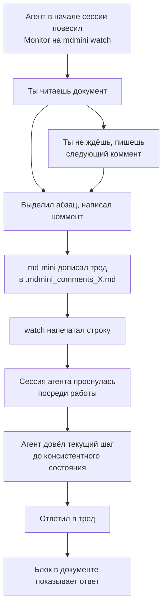

## П2. Никто не слушает

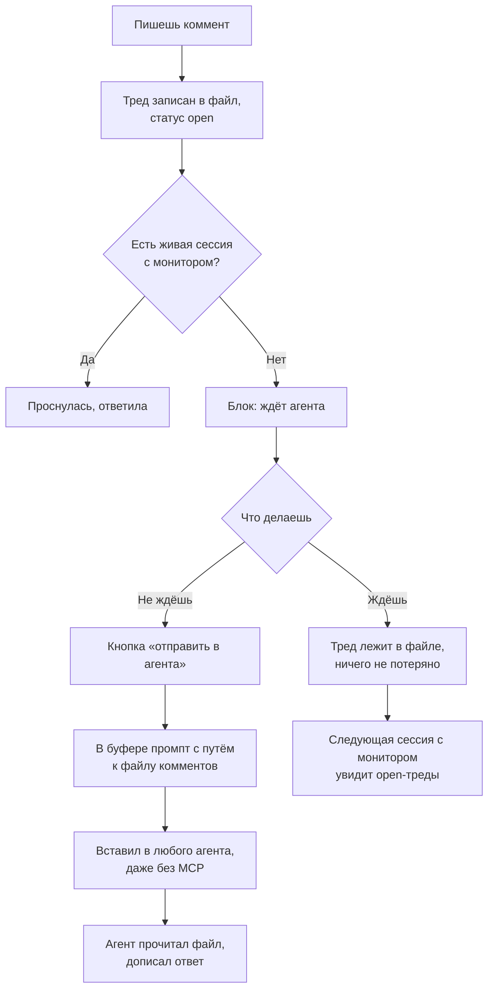

## П3. Переписка в треде

Файл — обычный markdown, поэтому тред это просто абзацы. Никакой модели данных
для многореплайного обсуждения не нужно.

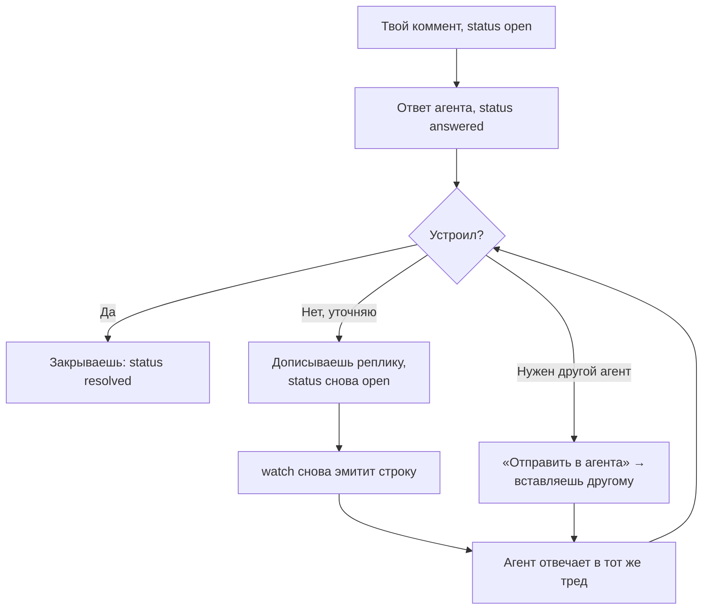

## П4. Коммент-правка, а не вопрос

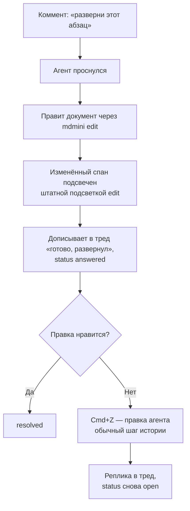

## П5. Монитор умер, а ты об этом не знаешь

Самый опасный сценарий именно потому, что выглядит как тишина.

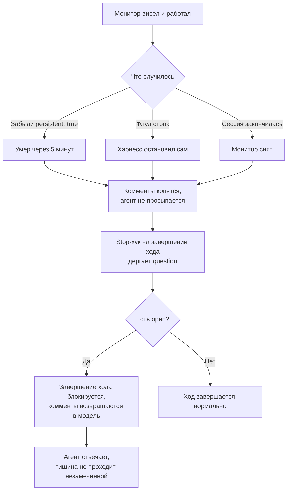

## П6. Якорь потерялся

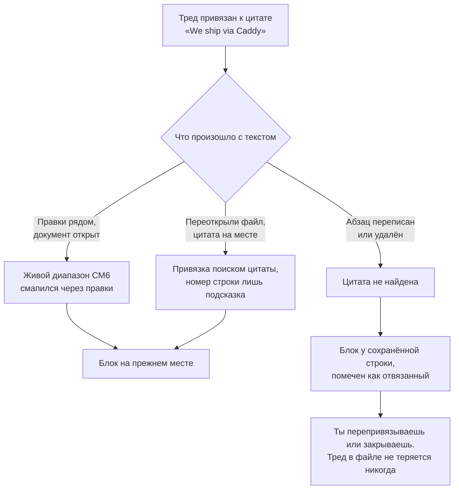

---

# Технические флоу

## Т1. Постановка монитора

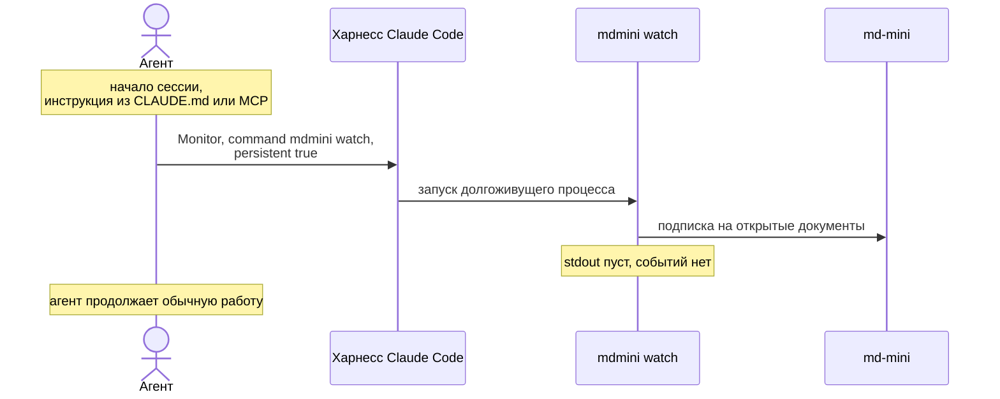

## Т2. Доставка нового коммента

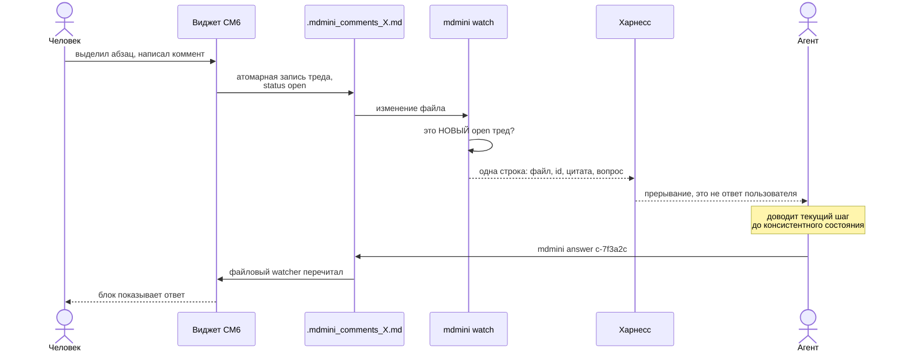

## Т3. Два писателя, один файл

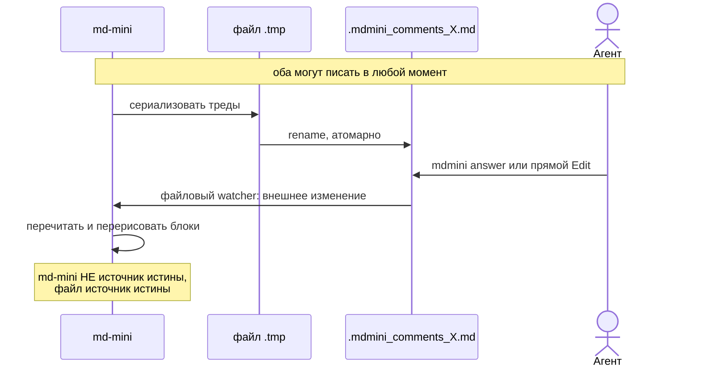

## Т4. Деградация по возможностям harness

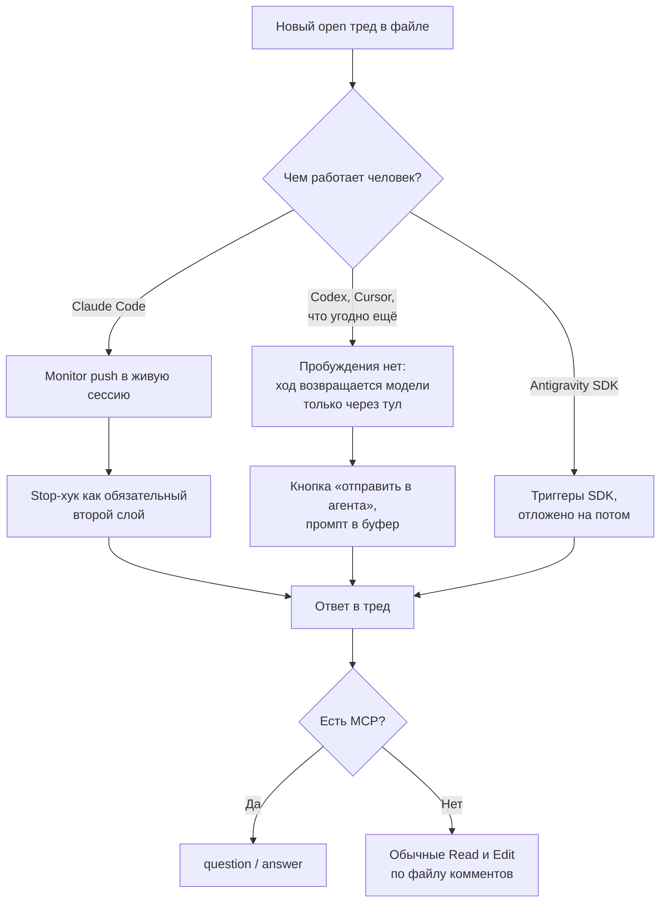

## Т5. Stop-хук

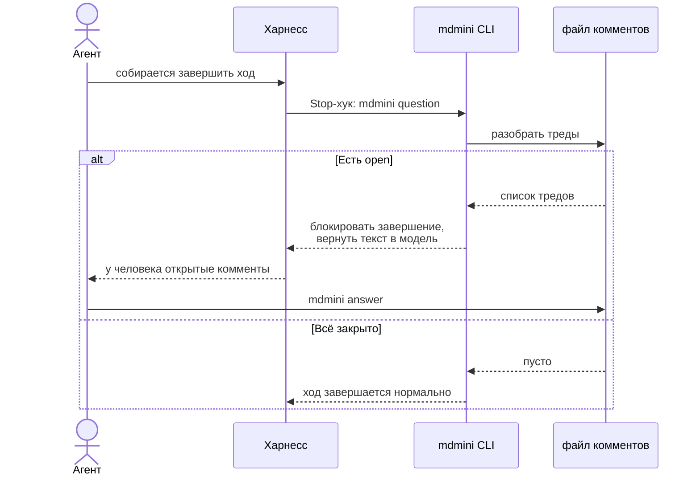

Точную обвязку хука — код выхода против JSON-решения и как именно текст доезжает
до модели — сверить с актуальным контрактом хуков на этапе плана. Отдаётся
сниппетом `mdmini agent --hook`, по аналогии с существующим `mdmini agent`.

## Т6. Что watch эмитит и что не эмитит

Флуд-контроль — не оптимизация, а условие работоспособности: харнесс убивает
болтливый монитор.

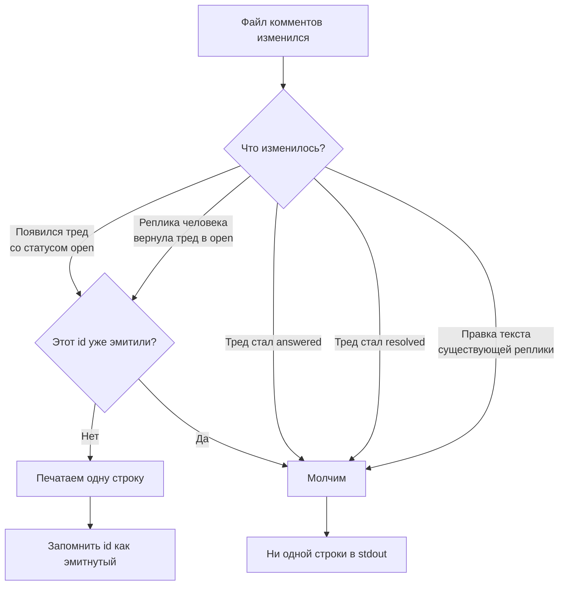

## Т7. Состояния треда

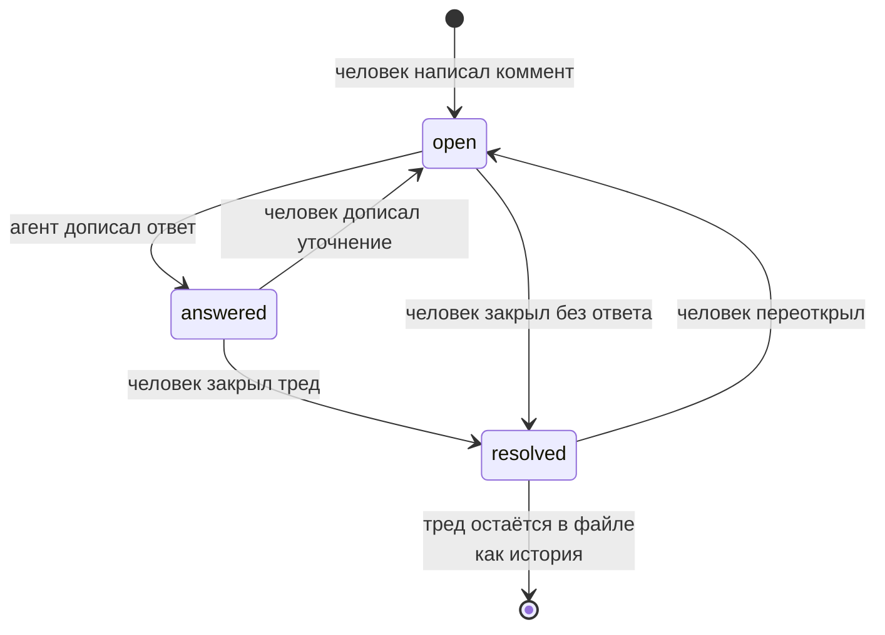

Тред из файла не удаляется никогда: `resolved` — это история, а не мусор. GC не
нужен, чистка — обычное редактирование файла человеком.

## Т8. Привязка якорей

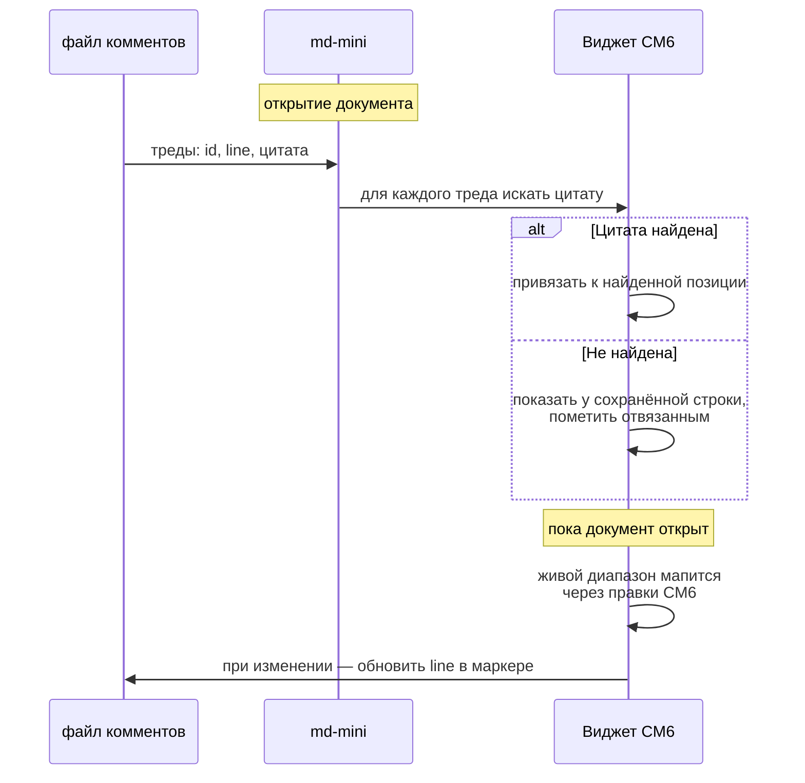

---

# UI

Блок-виджет под строкой якоря, классы `.cm-ai-comment-*` поверх токенов
`--ai-ask-*` — одна визуальная семья с вопросами агента от `ai-ask.ts`. Нулевой
margin у корня виджета, отступы на внешнем wrapper'е: это тот самый
задокументированный капкан height-map, из-за которого иначе ломается вертикальная
навигация каретки.

Блок показывает тред: реплики по порядку, автор и время, статус в шапке. Состояния:
`ждёт агента`, `отвечает`, `есть ответ`, `решено`, `якорь потерян`.

Кнопки: `ответить` (своя реплика в тред), `отправить в агента` (промпт в буфер),
`решено`, `вставить ответ в текст`.

Создание: клавиша плюс пункт в меню AI — «Прокомментировать выделенное». Пункт
меню обязателен: урок PR #11 в том, что у фичи должен быть постоянный дом, а не
одноразовая подсказка.

В буфер по кнопке «отправить в агента»:

```
В файле /path/.mdmini_comments_spec.md есть открытые комментарии к /path/spec.md.
Прочитай его, ответь на треды со статусом open — допиши реплику под тредом
и поменяй status на answered. Если нужна правка самого документа — примени её,
затем ответь в тред.
Если у тебя есть MCP md-mini: mdmini question и mdmini answer <id>.
```

# Границы модулей

| Модуль | Ответственность |
|---|---|
| `src-tauri/src/comments.rs` | Парсер и сериализатор файла комментов, атомарная запись, разрешение пути `.mdmini_comments_*` |
| `src-tauri/src/watch.rs` | `mdmini watch`: дедупликация эмитнутых id, формат строки события, флуд-контроль |
| `src-tauri/src/ai_socket.rs` | Две новые команды сокета, делегирующие в `comments`. Остаётся транспортом |
| `src-tauri/src/mcp_server.rs` | Те же две как MCP-tools |
| `src/lib/editor/ai-comment.ts` | Виджет треда и StateField, зеркало `ai-ask.ts` |
| `src/lib/comment-format.ts` | Чистые функции: парсинг и рендер формата, поиск цитаты для привязки. Тестируется без CM6 |

# Тесты

- Rust: round-trip формата, включая треды с несколькими репликами и цитатами со
  спецсимволами; атомарность записи при конкурентном писателе; дедупликация в
  `watch` (ни одного повторного эмита, статусные переходы молчат); отказ
  комментировать сам файл комментов.
- Vitest: парсер и рендер формата, поиск цитаты и состояние «отвязан», `eq()`
  виджета, рендер всех состояний треда, текст для буфера.
- Руками: `npm run dev:app`, реальный Monitor на `mdmini watch` — проверить
  пробуждение живой сессии, поведение без `persistent: true`, и что Stop-хук
  ловит случай убитого монитора.

# Не входит в v1

Antigravity SDK Triggers. Long-polling `question` с зацикливанием — отброшен
сознательно. Панель-инбокс по всем файлам. Синхронизация комментов между
машинами (её делает git, если владелец решит коммитить файл).

# Открытые вопросы

- Точная обвязка Stop-хука против актуального контракта хуков — на этапе плана.
- Формат строки события `watch`: сколько контекста влезает, чтобы агент мог
  триажить, не читая файл.
