# Обратный AI-канал: запросы из документа к агенту

Дизайн-спека. Статус: на ревью у владельца.

## 1. Рамка

Сегодня AI-интерфейс md-mini односторонний. Агент умеет `show` (покажи вот тут),
`edit` (вот новое содержимое) и `ask` (ответь на вопрос кнопками) — всё это идёт
**от агента к документу**. Обратно, от человека к агенту, канала нет: если ты
читаешь спеку и у тебя вопрос по абзацу, приходится переключаться в чат и
руками объяснять, о каком месте речь.

Фича добавляет обратное направление: **запрос**, который человек кладёт в
документ, а агент забирает и закрывает.

Запрос — это не «вопрос», а комментарий с двумя возможными резолюциями:
текстовый ответ либо правка документа. Правку агенту добавлять не нужно, у него
уже есть `mdmini edit`; запрос лишь должен закрываться в обоих случаях.

## 2. Принятые решения

| Развилка | Решение | Почему |
|---|---|---|
| Кто на другом конце | Гибрид: доставка сразу, если агент ждёт; иначе очередь в md-mini | Работает и с живой сессией, и без неё. Спавн агента из md-mini отброшен — это выход за рамки редактора |
| Адресация | Абсолютный путь файла + скоуп по cwd агента | Ноль новых сущностей, ноль регистраций. Каждая копия worktree — свой путь, значит свой канал: изоляция параллельных агентов бесплатно |
| Worktrees | Repo-scope с атомарным claim | Частый реальный случай: ты читаешь копию из main-чекаута, а агент живёт в `.claude/worktrees/foo`. Claim ровно один, кто взял — видно в блоке |
| Передача очереди | Claim — это лиза, а не pop | «Сессия схлопнулась» и «хочу спросить другого» становятся одним механизмом, а не двумя |
| Несколько агентов сразу | Только последовательный requeue в v1 | Веер требует N ответов и частичных таймаутов в UI. Формат хранения многоответный с первого дня |
| Ручная передача | ID запроса как capability-токен + кнопка «копировать команду» | Обходит роутинг целиком. Побочный эффект важнее основного: фича полезна с первого дня, даже если ни один агент не опрашивает очередь |
| Где живёт запрос | Вне текста документа, sidecar в app data | Полный `edit` от агента физически не может стереть запрос, git остаётся чистым |
| Вид | Блок-виджет под строкой якоря, как `ai-ask` | Оба направления выглядят одним диалогом. Переиспользует выстраданную механику, а не строит вторую такую же |

## 3. Модель данных

```
Request {
  id:       "q-7f3a2c"            // короткий стабильный ID, он же capability-токен
  path:     "/abs/path/spec.md"
  anchor:   { line: 42, quote: "We ship via Caddy" }
  body:     "Почему не nginx? Разверни абзац."
  state:    pending | claimed | answered | closed
  claim:    { by_cwd, at } | null
  answers:  [ { by_cwd, text, at } ]   // массив с первого дня
  excluded: [ by_cwd ]                 // кого не пускать после «переадресовать»
  created_at
}
```

Источник истины — Rust. Он обязан отвечать на `mdmini question <id>` независимо
от того, открыт ли документ, и переживать рестарт приложения. Хранилище —
`paths::app_data_dir()/requests.json`, то есть dev-сборка изолирована от релизной
автоматически. Фронт держит только живые позиции якорей в CM6 StateField и
репортит их назад тем же heartbeat-паттерном, что `update_session_document`.

GC: закрытые запросы старше N дней и запросы на исчезнувшие файлы удаляются.

## 4. Вербы

| Команда | Поведение |
|---|---|
| `mdmini next [<file>] [--timeout N]` | Забирает следующий запрос в скоупе и клеймит его. `--timeout 0` — мгновенная проверка «есть что-нибудь?». `--timeout 300` — блокирующее ожидание, зеркало `ask` |
| `mdmini question <id>` | Печатает запрос, путь, якорь и окружающий контекст. Скоуп игнорирует |
| `mdmini answer <id>` | Ответ со stdin, закрывает запрос. Скоуп игнорирует, побеждает чужую лизу |

Те же три — как MCP-tools, паритет с `show`/`edit`/`ask`.

---

# Пользовательские флоу

## П1. Живой агент ждёт — счастливый путь

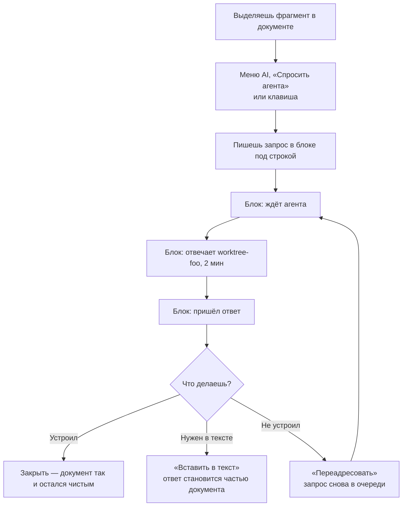

## П2. Никто не ждёт — вопрос лежит в очереди

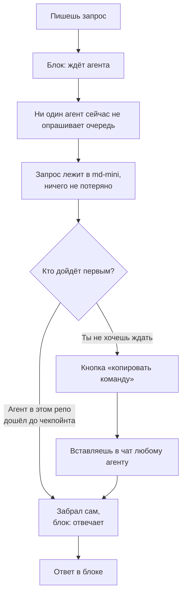

## П3. Ручная передача конкретного вопроса другому агенту

Основную спеку ты обсуждаешь с одним агентом, а один конкретный вопрос хочешь
отдать другому — не трогая очередь и не переключая контекст первого.

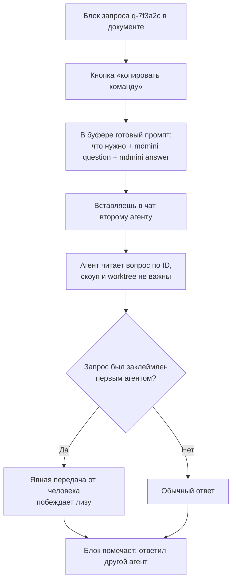

## П4. Запрос на правку, а не на ответ

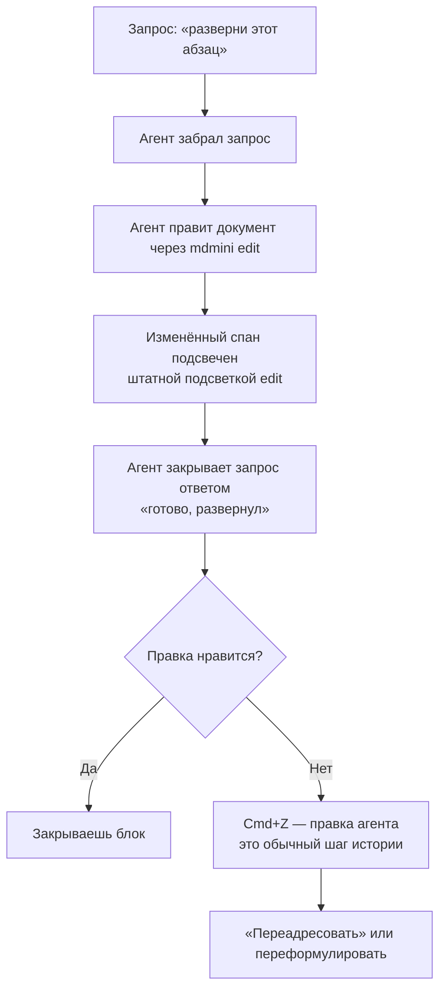

## П5. Сессия агента схлопнулась

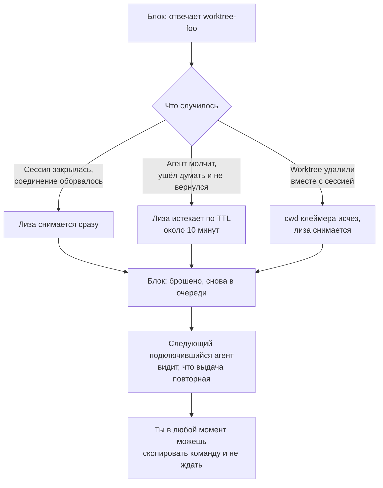

## П6. Якорь потерялся

Запрос живёт вне текста, поэтому он не может испортить документ — но текст под
ним может быть переписан до неузнаваемости.

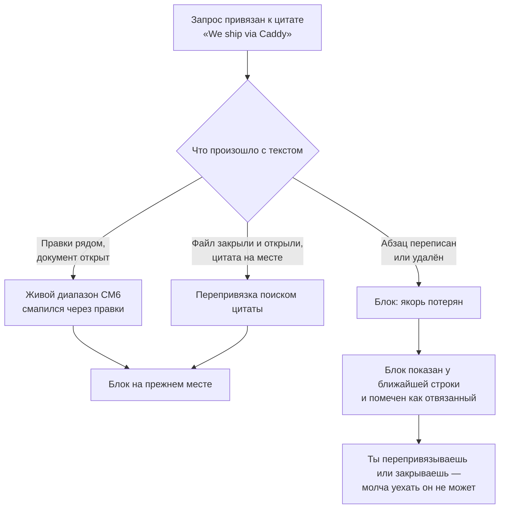

---

# Технические флоу доставки

## Т1. Живая доставка: агент уже ждёт

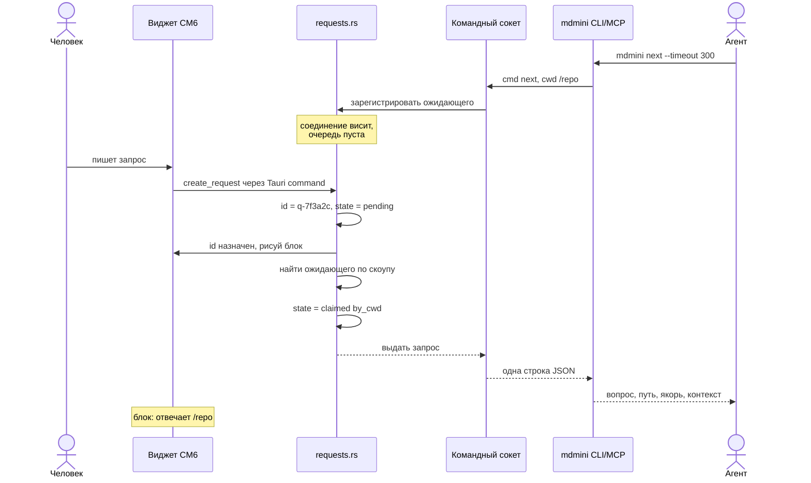

## Т2. Очередь и поздний забор на чекпойнте

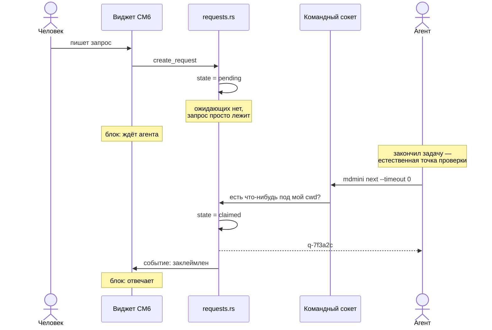

Ноль стоимости для агента, у которого ничего не лежит: `--timeout 0` отвечает
сразу. Именно это делает «поглядывать» реалистичным как инструкцию в
`mdmini agent`.

## Т3. Разрешение скоупа, включая worktrees

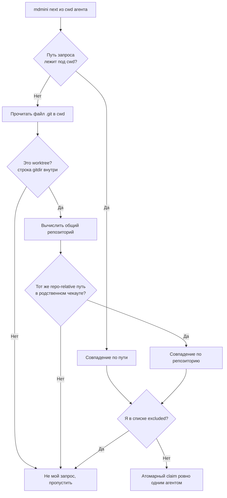

Родство определяется чтением файла — у worktree `.git` это текстовый файл со
строкой `gitdir:`. Никакого спавна `git` не требуется.

## Т4. Обход роутинга по ID

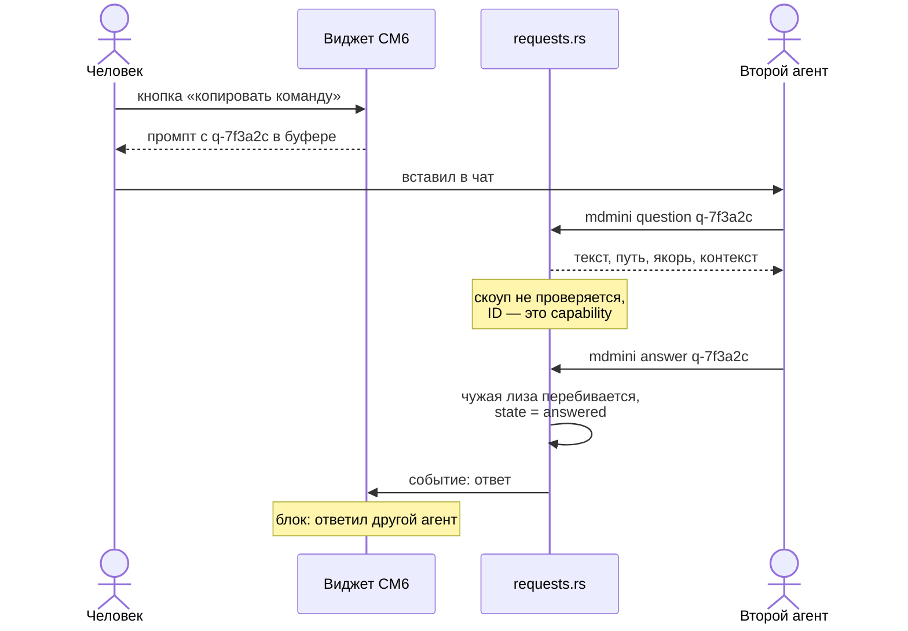

## Т5. Жизненный цикл лизы

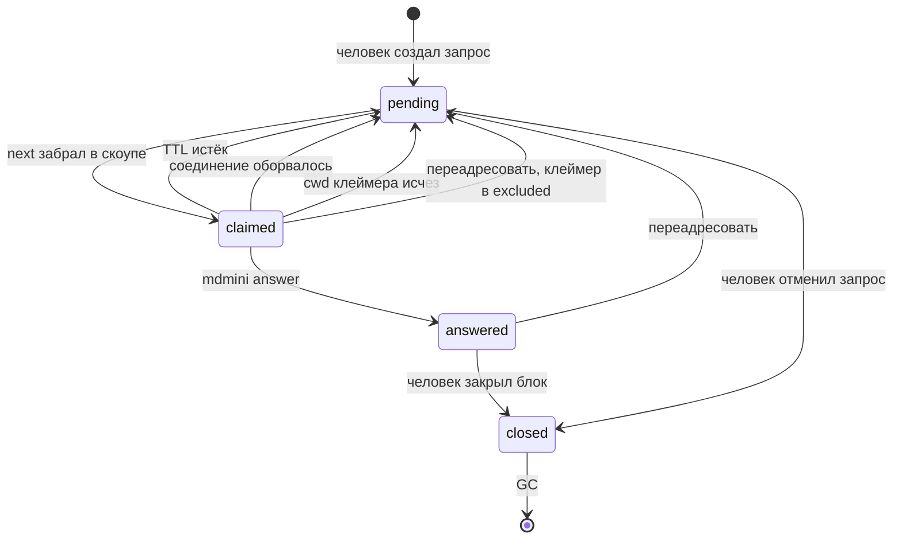

Ключевая мысль: «передача очереди другой сессии» — не отдельный механизм, а
дефолтное поведение. Очередь принадлежит md-mini, агенты к ней только
подключаются.

## Т6. Обратный путь ответа в документ

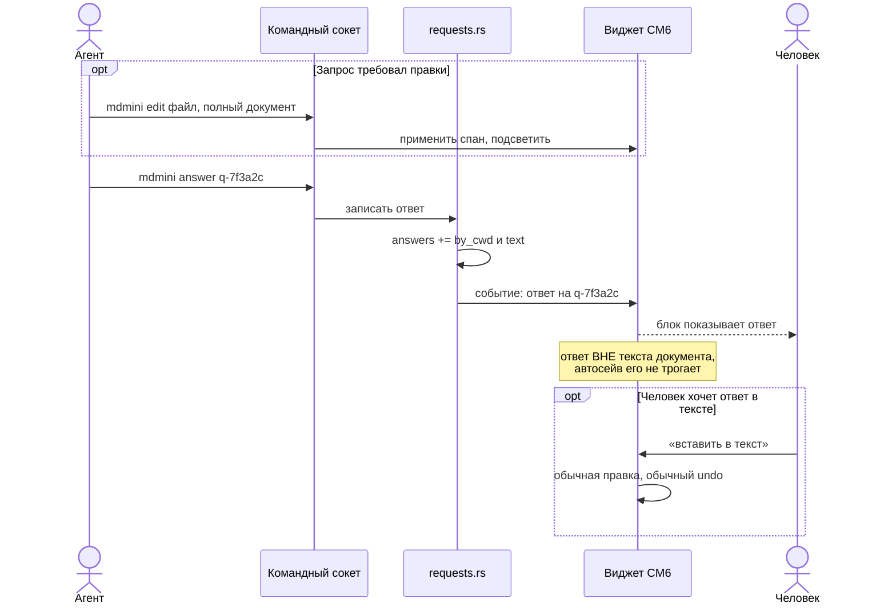

Полный `edit` от агента не может стереть запрос: запроса нет в тексте документа.
Это и было главным аргументом за хранение вне markdown.

## Т7. Рестарт и перепривязка

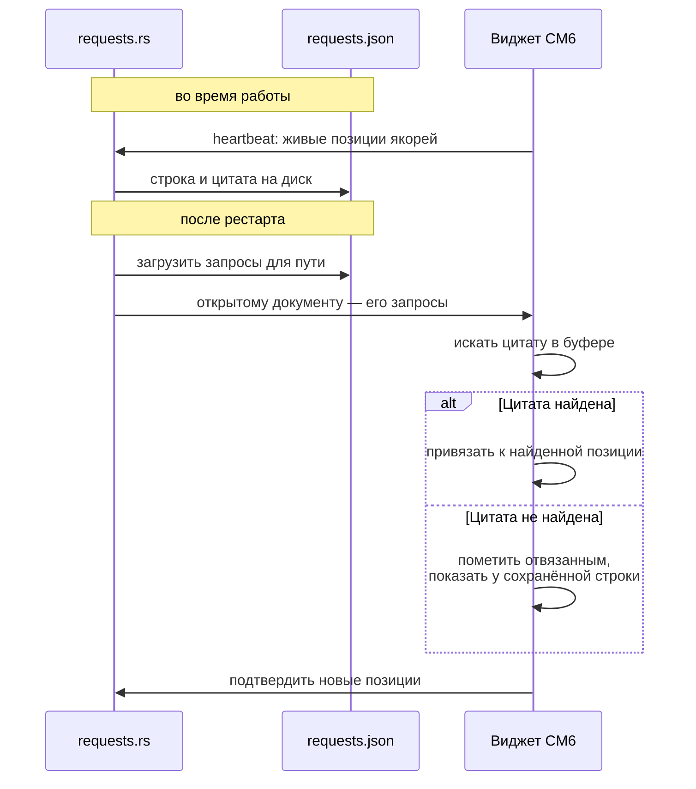

---

# UI

Блок-виджет под строкой якоря, классы `.cm-ai-request-*` поверх токенов
`--ai-ask-*` — одна визуальная семья с вопросами агента. Нулевой margin у корня
виджета, отступы на внешнем wrapper'е: это тот самый задокументированный капкан
height-map, из-за которого иначе ломается вертикальная навигация каретки.

Состояния в шапке блока: `ждёт агента`, `отвечает worktree-foo, 2 мин`, `ответ`,
`брошено, снова в очереди`, `якорь потерян`.

Кнопки: `копировать команду`, `переадресовать`, `вставить в текст`, `закрыть`.

Создание: клавиша плюс пункт в меню AI — «Спросить агента о выделенном». Пункт
меню обязателен: урок PR #11 в том, что у фичи должен быть постоянный дом, а не
одноразовая подсказка.

В буфер уезжает:

```
Ответь на вопрос q-7f3a2c из /path/spec.md (md-mini).
Прочитать:  mdmini question q-7f3a2c
Ответить:   mdmini answer q-7f3a2c    # текст на stdin
Нужна правка документа — примени её через mdmini edit, затем закрой вопрос ответом.
```

# Границы модулей

| Модуль | Ответственность |
|---|---|
| `src-tauri/src/requests.rs` | Стор, машина состояний, лиза, разрешение скоупа, GC. Новый файл: `ai_socket.rs` уже 1910 строк и должен остаться транспортом |
| `src-tauri/src/ai_socket.rs` | Три новые команды сокета, делегирующие в `requests` |
| `src-tauri/src/mcp_server.rs` | Те же три как MCP-tools |
| `src/lib/editor/ai-request.ts` | Виджет и StateField, зеркало `ai-ask.ts` |
| `src/lib/ai-request-text.ts` | Чистые функции: текст для буфера, перепривязка по цитате. Тестируется без CM6 |

# Тесты

- Rust: машина лизы (claim, TTL, requeue, excluded), матчинг скоупа включая
  разбор worktree-`.git`, round-trip и GC стора.
- Vitest: `eq()` виджета, рендер всех состояний, перепривязка якоря и «отвязан»,
  билдер текста для буфера.
- Руками: `npm run dev:app` плюс два фейковых агента через сокет — проверить
  атомарность claim и все три пути снятия лизы.

# Не входит в v1

Веер по нескольким агентам одновременно (формат хранения уже готов), треды с
несколькими репликами, панель-инбокс по всем файлам, синхронизация запросов
между машинами.
