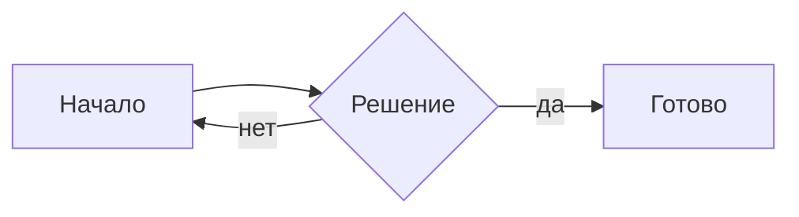
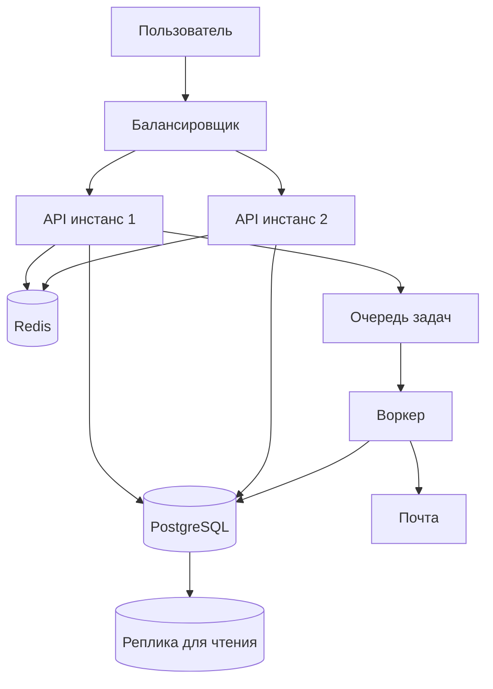
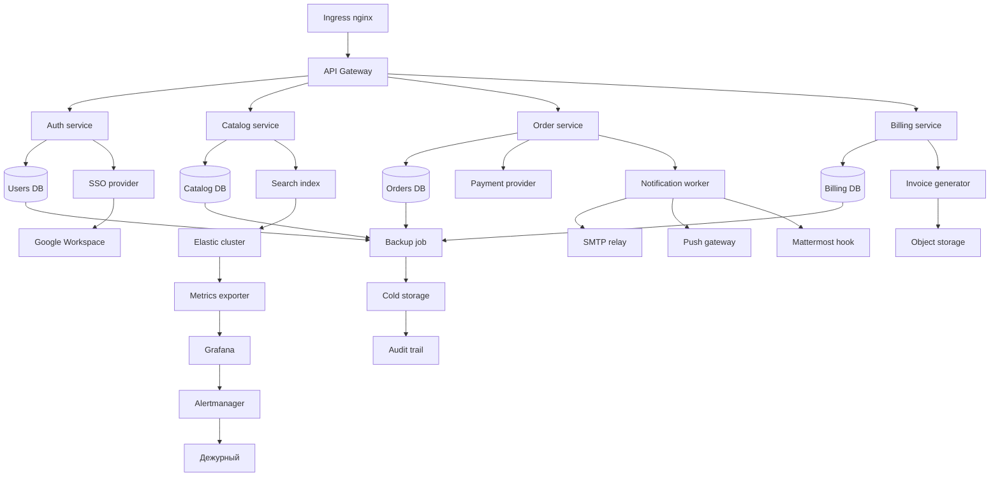

# Mermaid pan/zoom — тестовые кейсы

Что проверять на трекпаде:

- **Пинч двумя пальцами** — зум вокруг курсора, всегда работает
- **Свайп двумя пальцами при обычном масштабе** — листает документ, диаграмма стоит
- **Свайп после зума** — панит диаграмму, документ стоит
- **Свайп, когда диаграмма упёрлась в край** — документ снова начинает листаться
- **Drag левой кнопкой** — панит всегда
- **Двойной клик** — на полном виде зумит 2×, при зуме возвращает полный вид
- **`⤢` в правом верхнем углу** — полный вид, скролл документа снова свободен
- **Ручка внизу рамки** — тянет высоту, двойной клик по ней сбрасывает на авто

Отдельно: покрути зум на диаграмме, уведи её скроллом за экран, вернись — масштаб
должен сохраниться. И попробуй поправить текст выше диаграммы: масштаб тоже должен
выжить.

## Малая диаграмма

Должна показываться ровно как раньше — 100%, рамка обжата по контенту, свайп над
ней листает документ.

## Много текста, чтобы листалось

Инфраструктура отдела держится на трёх опорах: воспроизводимость, наблюдаемость и
предсказуемое время восстановления. Первое даёт Ansible: любой сервер собирается из
плейбука с нуля, руками в прод никто не ходит. Второе — метрики и логи, которые
собираются централизованно, а не ищутся по хостам через ssh. Третье — регулярные
учения по восстановлению, потому что бэкап, который никогда не проверяли
восстановлением, бэкапом не является.

Секреты не живут в коде и конфигах. Всё, что нужно приложению в рантайме, приходит
из переменных окружения, которые наполняются из хранилища при деплое. Ключи ротуются
по расписанию, а не когда кто-то вспомнил. Доступы выдаются по принципу минимальных
привилегий: если сервису нужна одна таблица, он получает права на одну таблицу, а не
на всю базу.

Отдельная история — периметр. Каждый publicly exposed сервис проходит через реверс-прокси
с TLS, рейт-лимитами и базовой фильтрацией. Прямых портов в интернет нет. Административные
интерфейсы доступны только через VPN, и это не обсуждается даже для «временно, на один
день, очень срочно».

Мониторинг устроен по симптомам, а не по причинам. Алерт «диск заполнен на 85%» будит
дежурного зря, если тренд плоский третий месяц. Алерт «время ответа API выросло втрое»
будит по делу. Дежурство не должно превращаться в фоновый шум, иначе на настоящую
аварию человек отреагирует так же, как на двадцатый ложный пейдж за ночь.

Изменения в инфраструктуре проходят ревью. Не потому, что автору не доверяют, а потому,
что вторая пара глаз ловит то, чего первая не видит по определению: автор проверяет,
работает ли его сценарий, а ревьюер спрашивает, что будет, когда сценарий не сработает.

CI не право, а обязанность. Пайплайн собирает, тестирует и подписывает артефакт, и
только подписанный артефакт попадает в прод. Ручная сборка на ноутбуке «потому что
пайплайн красный» — это ровно тот случай, из которого потом вырастает инцидент,
который никто не может воспроизвести.

База данных — самое дорогое, что есть в системе, и самое хрупкое. Миграции идут только
вперёд и только совместимо: новая схема должна работать со старым кодом, потому что во
время раскатки в кластере живут обе версии одновременно. Схема без обратной совместимости
превращает деплой в окно простоя.

## Средняя диаграмма

Тут проверь пинч и пан — диаграмма уже не влезает целиком в комфортном масштабе.

## Большая диаграмма сразу после средней

Две рамки подряд без текста между ними — проверь, что они не слипаются, что скролл
между ними ведёт себя предсказуемо и что зум одной не влияет на другую.

## Снова много текста, чтобы листалось

Инциденты бывают у всех, разница только в том, сколько времени уходит на понимание
причины. Поэтому важнее всего не героизм дежурного, а качество следов, которые система
оставляет о себе: структурированные логи с идентификатором запроса, трассировка между
сервисами, метрики с разумной гранулярностью. Когда всё это есть, разбор занимает
двадцать минут вместо шести часов.

Постмортем пишется без поиска виноватых. Вопрос не «кто уронил», а «почему система
позволила это уронить одним действием». Если один неверный ввод в одной форме способен
остановить обслуживание, проблема не в человеке, который ввёл, а в отсутствии проверки
и отсутствии возможности быстро откатиться.

Документация живёт рядом с кодом и обновляется тем же пулл-реквестом. Вынесенная в
отдельную вики, она устаревает за месяц и начинает активно вредить: человек читает,
делает по написанному и ломает то, что уже переделали полгода назад. Устаревшая
инструкция опаснее отсутствующей, потому что вызывает ложную уверенность.

Автоматизация оправдана, когда действие повторяется и его цена ошибки высока. Скрипт,
который запускается раз в год, будет к моменту запуска сломан изменившимся окружением,
и его отладка займёт больше времени, чем ручное выполнение. Автоматизировать надо
частое и рискованное, а не всё подряд ради красивой цифры покрытия.

Онбординг измеряется одним числом: сколько времени проходит от выдачи ноутбука до
первого задеплоенного изменения. Если это число измеряется неделями, значит окружение
собирается вручную по устным договорённостям. Хорошая цель — один день, и достигается
она не бодростью новичка, а тем, что окружение поднимается одной командой.

Технический долг не исчезает от того, что его не записали. Он просто становится
невидимым и всплывает в самый неудобный момент — обычно когда нужно быстро выпустить
что-то важное, а нельзя, потому что три года никто не обновлял зависимости и апгрейд
теперь означает переписывание половины модуля.

Выбор технологии — это выбор проблем, с которыми ты готов жить. Не бывает решения без
недостатков, бывает решение, чьи недостатки терпимы для конкретной задачи. Поэтому
сравнивать надо не по списку фич, а по тому, как система ведёт себя под нагрузкой, что
происходит при отказе узла и насколько понятно, что делать, когда всё сломалось.

Резервирование имеет смысл только вместе с проверкой. Два инстанса за балансировщиком
дают отказоустойчивость лишь тогда, когда балансировщик действительно замечает падение
одного из них и перестаёт лить на него трафик. Иначе это два инстанса и один способ
терять половину запросов.

И последнее: любая система в итоге упирается в людей, которые её эксплуатируют. Самая
изящная архитектура развалится, если дежурный не понимает, как она работает, а самая
скучная переживёт годы, если её поведение предсказуемо и документировано. Скучное и
понятное почти всегда побеждает изящное и хитрое.
